

---
openHAB2 Raspberry beginner’s walkthrough – (Using Raspberry Pi 3 with openHAB2 and Z-Wave, WiFi LED, Samsung TV and YahooWeather bindings for a home automation project)
---

# Chapter 1: Before you start
## Is openHAB2 the right choice for my home automation project?
Be aware that openHAB2 is an OPEN home automation solution which is strongly living from a very supportive community. If you want to have a plug and play solution with supplier guaranteed service level and a high likeliness that all the features are working and all the hardware is compatible, you might be better off in getting a ready to use home automation kit including the designated controller (like e.g. devolo or homematic IP). Consider this especially if you are planning to do safety related automation or emergency detection like fire alarm. 
If you, on the other hand, are willing to spend a few hrs/days in learning how to do a little installation and coding yourself and have no problems with the service level of a Raspberry Pi 3 (it is not as failsafe as other controllers) you might find a perfect environment with openHAB2 for your low cost, very flexible and continuously improving home automation environment.

## Introduction:
This tutorial is targeting beginners like me to get a step by step guideline to get all the things installed. Since I am no coding expert and have no experience in Raspberry and Raspbian I am trying to go through the things step by step, so you should be able to get everything done, even without exactly having to go into all the details. That is one of the reasons I am also using the graphical GUI PIXEL for Raspbian since I thing it makes it easier for the beginners to get started (and you might want to use PIXEL anyway when you are using the Raspberry 7” display as interface for your home automation controller)
This tutorial is also based on **having a Windows PC** to support the setup process. You might be able to completely do it without the support of an extra PC, if you can get a MicroSD card with a pre-installed Raspbian OS and use the display options (the Raspberry 7” display or HDMI Display) for the Raspberry.

***DISCLAIMER:
This tutorial might contain some typos, errors or ways of setting up, which can be done in a better way. I am just reflecting my process of starting from scratch and slowly working my way through hundreds of online tutorials, manuals, forum threads etc. and on the way, highlighting the issues I had in getting things working. There will be no guarantee that the given instructions are working for your project as well.***

Anyway I hope this tutorial will help some beginners to enjoy home automation with openHAB2.

## A few words about the 2 in openHAB2:
The 2 in openHAB2 is important! The tutorial is based on the openHAB2 and will not go into all the details of the old version.
You just have to be aware, that a lot of online documentation is still for the openHAB version and will not be applicable for openHAB2!
So the best thing is always to go to the official webpage of openHAB2 and start from there, and only if you really can’t find the information or the link there, go to google and search for other solutions. I was always using the search setting (last year) so it was more likely to the results considering openHAB2 and not openHAB.

---
# Chapter 2: Preparation
Shopping list:
As mentioned before, I am basing this tutorial on the graphical GUI of Raspbian named PIXEL so the shopping list is also containing parts for this optional setup:

## Minimal hardware setup of the controller with external display:

|Description|Image|
|---|---|
|Raspberry Pi 3|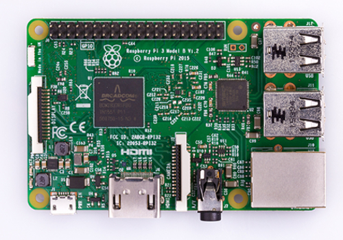|
|MicroSD card 16GB (minimal to have some buffer for the future) Make sure you have the right card reader to plug the MicroSD card into your computer!|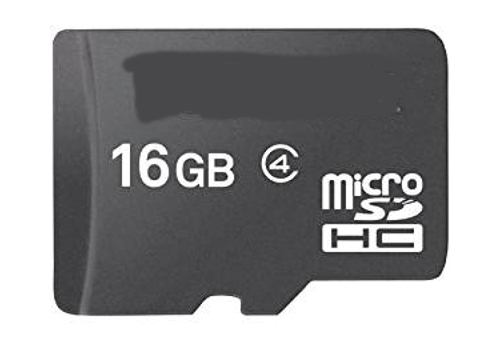|
|Designated Raspberry power supply (min. 2,5A 5V, I recommend 3A) Do not use other USB chargers since insufficient power supply (shown in GUI as lightening symbol in the upper right corner) will result in serious issues like e.g. Bluetooth not working) A cable switch might be a good thing since you might have to hard-reset your Pi in the early days more often and the Pi itself does not have a power switch||
|USB Mouse||
|USB Keyboard||
|HDMI cable, full size to whatever your display needs (Obsolete, if you going for the 7” Raspberry display setup)|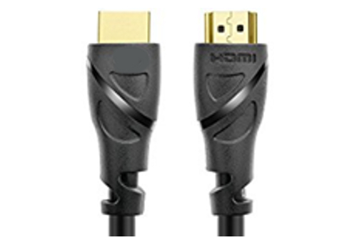|
|Display with HDMI input (Obsolete, if you going for the 7” Raspberry display setup)|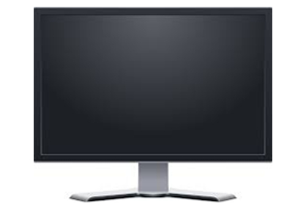|
|*Optional:* Raspberry case (Obsolete, if you going for the 7” Raspberry display setup)|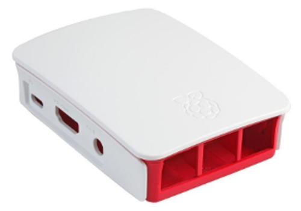|
|*Optional:* Ethernet cable (Obsolete, if you not want to use WiFi to connect the Raspberry to your gateway)|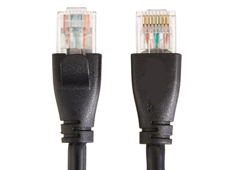|

## Additional hardware for optional setup of the controller with 7” Raspberry display:
(I found it very useful to have one permanent GUI interface mounted on your controller, you can also use this touchscreen interface directly to interact with your home automation):

|Description|Image|
|---|---|
|Raspberry Pi 7" Touch-Display|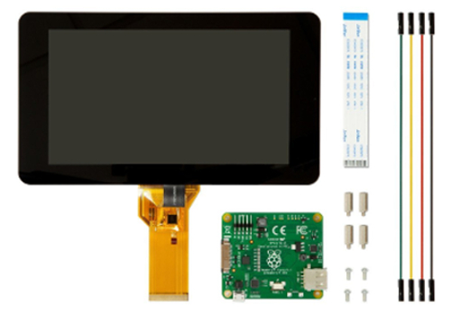|
|Premium case for Raspberry Pi 7" Touch-Display (closed version) often sold in bundle with Touch-Display, should be available in black, white and transparent. This is a very good case if you want to place the controller on a table or counter since it is protecting the Raspberry from the back.||
|*Alternative:* Cases for Raspberry Pi 7" Touch-Display. You will find a wide range of other cases. The open versions might give you a better access to the Pi GPIO pins or for changing SD card. Please consider: since you can rotate the image of the GUI on the display you can also choose to switch from landscape to portrait orientation.||
|Bluetooth keyboard (optional, since the optional on screen touch keyboard for Raspbian PIXEL was not working without errors, I decided to go for a Bluetooth keyboard which makes the typing much easier)|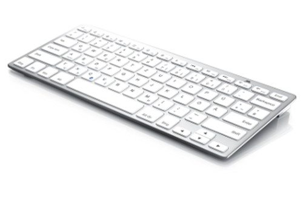|

## Z-Wave Controller hardware
If you want to use the Z-Wave technology for your home automation project you have to have one Z-Wave controller connected to your Raspberry
**NOTE:** Be aware that the details serial numbers or item names may vary since you have to always make sure to use the hardware which is allowed in your country!

|Description|Image|
|---|---|
|UZB Z-Wave PLUS USB stick by Z-Wave.Me *Pros:* Cheapest controller, small. *Cons:* For inclusion, the controller has to be plugged into the Raspberry, so for mounted devices like wall switches , you have to take the Raspberry in close proximity of the device or do the inclusion before you mount the switch inside the wall.|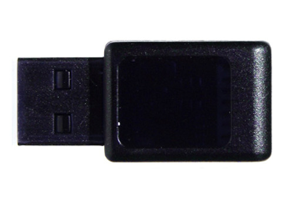|
|*Alternative:* Aeotec by Aeon Labs Z-Stick Gen5 *Pros:* Allows offline inclusion of Z-Wave devices which makes it very easy since you only have to take the stick to the mounted device, not the entire Raspberry. *Cons:* Including battery powered devices into openHAB2 requires a special process and might cause errors(see tutorial]||
|*NOT REALLY an Alternative:* Z-Wave Z-Wave.Me Razberry 2 Daughter Card for Raspberry Pi Home Automation (not plug and play compatible with optional setup of the controller with 7” Raspberry display!)*Pros:*	will be mounted directly on the Raspberry so it is not using a USB port *Cons:*	will be mounted directly on the Raspberry which is blocking the GPIO pins for e.g. the Display power supply or additional cooling fans, so you have to manually solder the power wires at the back of the razberry. Is using the i/o port of the Raspberry Pi 3 on board Bluetooth, so a lot of additional configuration is needed to get the razberry and the Bluetooth running in parallel. Most expensive controller.|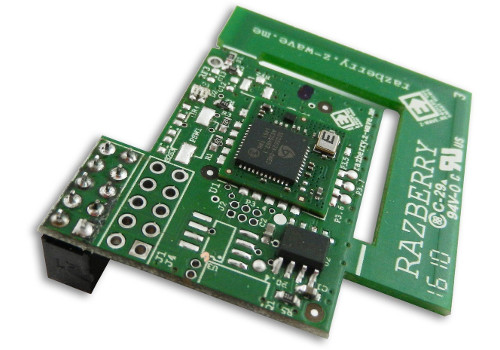|

## Z-Wave sensors, switches and actuators

**NOTE:** Be aware that the details serial numbers or item names may vary since you have to always make sure to use the hardware which is allowed in your country!
Since I am doing a German based home automation project you may find that some Z-Wave devices are not sold in your required country configuration ( e.g. Z-Wave NodOn Smart Plug not available e.g. in the US)

|Description|Image|
|---|---|
|Z-Wave Fibaro Double Switch 2, Z-Wave Plus Smart Switch (comes at almost the same costs than the single switch and gives you 2 channels. Only reason to go for single switch is you need the full power range of the single switch since the double switch has slightly lower range) *NOTE:* This switch is designed to be installed in the electrical power wiring of your home (inside a distributor case). In some countries this may only be allowed to be done by special trained staff (insurance and/or law). ||
|Aeotec Multi-Sensor 6 ZW100-C - Z-Wave Plus|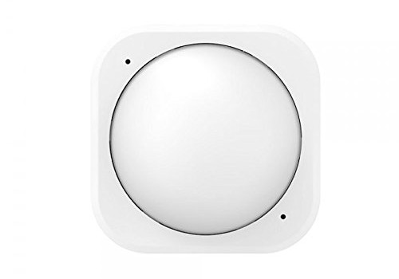|
|Z-Wave Aeon Labs ZW088 Z-Wave Key Fob, Gen5||
|Z-Wave NodOn Smart Plug (not available e.g. in the US)|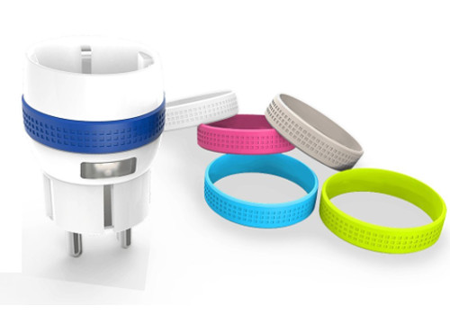|

**NOTE:** If you want to by other Z-Wave devices always make your they are listed in the Z-Wave device list of the openHAB2 Z-Wave binding to make sure they are supported correctly in the context of openHAB2:
http://www.cd-jackson.com/index.php/zwave/zwave-device-database/zwave-device-list

**LAN devices (cable or WiFi)**
A lot of things you are using at home are already connected to your LAN and can be integrated into your openHAB2 home automation project if the right binding is available for that device.
You can find an overview on http://docs.openhab.org/addons/bindings.html

**NOTE:** Be aware that not all the bindings to include devices are already included in the stable version of openHAB2 and may require a manual installation of a so called snapshot version of the binding (how to install snapshot bindings is explained later in this tutorial since we will need it for the WiFi LED controller)

|Description|Image|
|---|---|
|WiFi XCSOURCE Magic UFO-WiFi LED-Controller Type LD382 (other brand names might work as well, but you have to make sure it is Type LD382, LD382A or LD686) *REMARK:* I was using a WiFi controller on purpose since: It is only about half the price of a Z-Wave WiFi controller. You can control the device as well via smart phone (like light to music feature of the app)But some things you have to be aware of using WiFi LED instead of Z-Wave LED: You have to have a WiFi network to which your Raspberry and your WiFi LED controller is connected. You have to manually install a beta / snapshot version of openHAB2 or manually install the WiFi LED Binding on top of the package based installation of openHAB2 (see tutorial).|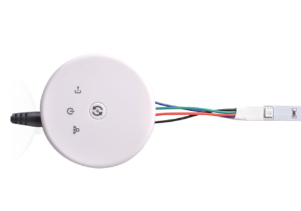|
|RGB LED stripe incl. power supply 12V DC bundle. While you can buy the stripe and the power supply bundle separately, most of the times the bundle will come at the same price or even cheaper. The included power supply plug should directly fit into the power inlet socket of the WiFi controller. *REMARK:* It also allows you to attach the stripe without soldering since you can just cut the cable of the RGB bundle controller and use it to connect the LED stripe to the WiFi controller.||
|*Optional:* White LED stripe. Since the WiFi LED-Controller is allowing you to at additionally control plain colour LED stripe (or in case of controller type LD686 even two) you might want to get an additional strip in e.g. plain white to create ab clear white illumination. *NOTE:* You might be fine with just the stripe if you already got the power supply with the RGB stripe||
|*Optional(in my case it was already there and I just included it into my project):* Yamaha Receiver RX-V581||
|*Optional(in my case it was already there and I just included it into my project):* **Samsung TV Details MISSING** *NOTE:* Even when the binding is not officially supporting your TV you might be lucky||

## Software list:

My tutorial is using a MS-Windows windows machine for the PC part (You should be able to get it done with Mac or Linux PCs as well, but you have to go online to look up the differences and do some adaptions on the tutorial e.g. mounting the Raspberry file system to PC)

### Windows Download list:

|Description|URL|
|---|---|
|The latest **Raspbian** (Raspberry OS) image. You have to download the “Raspbian Jessie with PIXEL - Image with PIXEL desktop based on Debian Jessie” since this tutorial is using PIXEL|https://www.Raspberrypi.org/downloads/Raspbian/|
|**Etcher** (to write the Raspbian image to the SD-Card)|https://etcher.io/|
|**Eclipse Smart HomeDesigner** (optional but strongly recommended for easy editing of OpenHAB2 configuration files; incl. syntax highlighting) You have to choose the right version for your PC|https://www.openhab.org/downloads.html|
|To use Eclipse Smart HomeDesigner you need **Java Runtime Environment JRE** (if not already installed on your PC)|https://java.com/|
|**PuTTY** or **KiTTY** portable to access the Raspberry console from your PC|http://www.putty.org/ or https://portableapps.com/apps/internet/kitty-portable|
|**WinSCP** portable to access Raspberry file System directly from your PC (might become obsolete if you use a SAMBA server on your Raspberry, see tutorial)|https://winscp.net/eng/download.php|

### Raspberry downloads:
How to download software will be explained in the tutorial, but as a reference you will use:
- **openHAB2** Package repository based installation or manual installation (be aware that the file locations on the Raspberry will be different based on which kind of installation you choose)
- **Samba** server(for access of Raspberry files from Windows machine; needed for Eclipse Smart HomeDesigner)
- **xscreensaver** (optional if you are using the display setup, to easy control screen blackening or screen savers)

---

# Chapter 3: Raspberry hardware and Raspbian OS installation
## General information about Raspberry interfaces and GPIO pins:
### Raspberry input Overview:
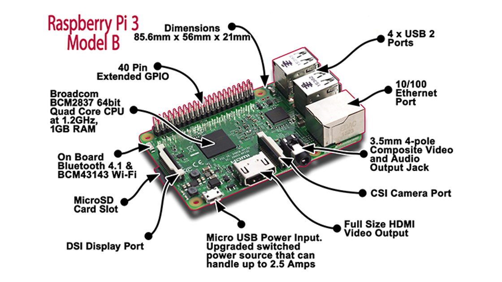

### Raspberry GPIO pin Overview:
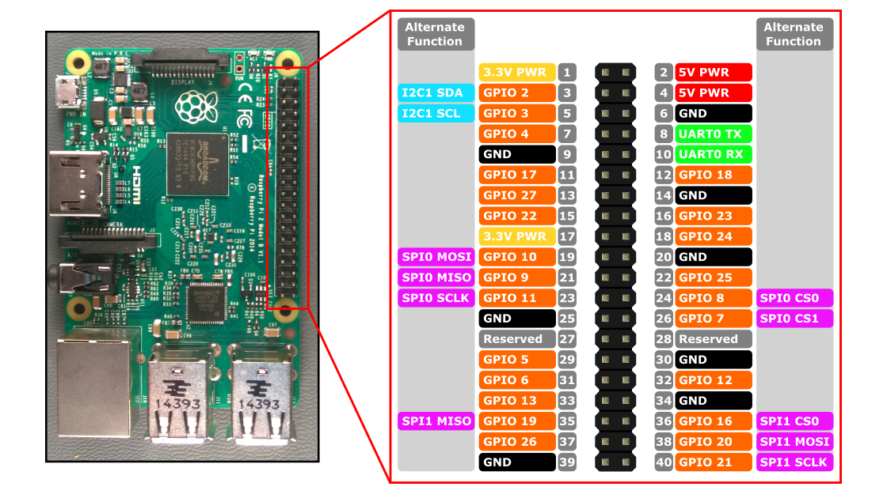

### Preparing MicroSD card - writing Raspbian image to MicroSD card (PC required):
|Description|Image|
|---|---|
|Download latest Raspbian Release (*.zip file) to a Windows folder|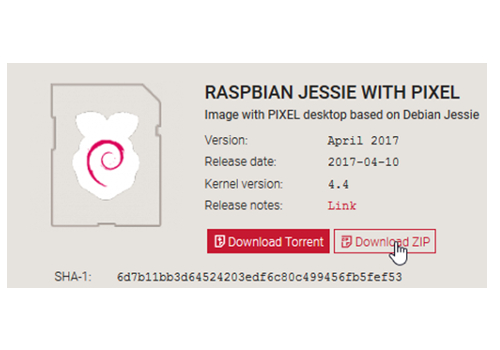|
|Extract *latestimage*.zip file to receive *latestimage*.img file|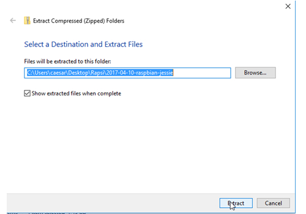|
|Use Etcher to write image to a MicroSD card: 1. select image 2. select drive with MicroSD card plugged in to 3. start flashing|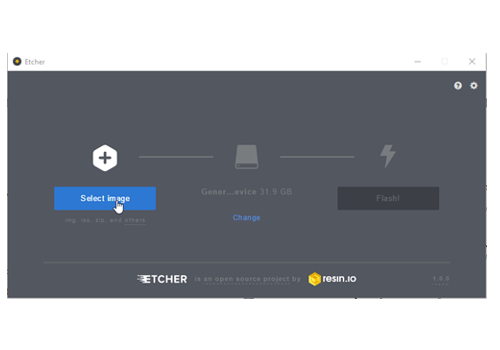|

### Connecting the hardware to the Raspberry
#### Basic hardware setup:
|Description|Image|
|---|---|
|Connect keyboard and mouse to the USB ports|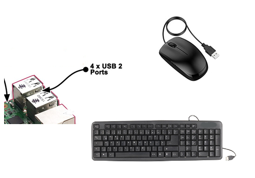|
|Insert the MicroSD card (pins facing the circuit board)|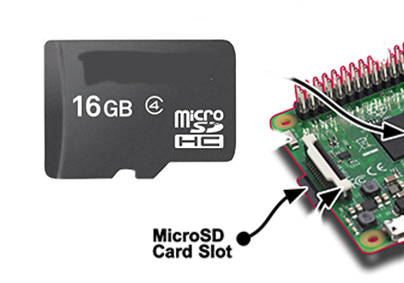|
|Connect Raspberry with display using HDMI (Obsolete, if you going for the 7” Raspberry display setup)|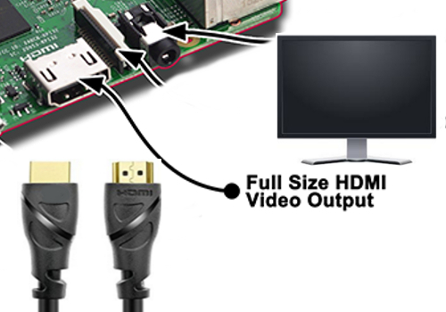|
|Connect the Raspberry with Ethernet cable to your gateway (optional)|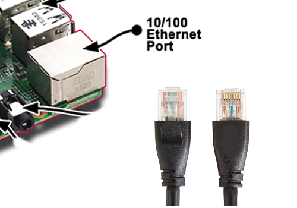|
|Connect the power supply to the micro USB power input **Make sure that you have everything plugged in and the Raspberry is clear of any metal items since this step is already powering up your Raspberry.**||

### Optional: Installation of 7” Raspberry display and display case:
The full tutorial will be found on:

https://www.element14.com/community/docs/DOC-78156/l/Raspberry-pi-7-touchscreen-display

and a clip on YouTube:

https://www.youtube.com/watch?v=tK-w-wDvRTg

*Remark:* I had an issue with plugging in the power supply to the micro USB power input on the circuit board of the display (like shown in the video). The Raspberry was still showing me the low power symbol (lightening symbol on the upper right corner) SOLUTION:  I had to plug in the power supply to the micro USB power input on the Raspberry itself. The display is now powered via the jumper cables. The standard display case is also allowing for both micro USB power inputs to be used.

**NOTE:** If the image on the display is having the wrong orientation, you can rotate the image by changing the configuration of Raspbian (see tutorial section Initial configuration of Raspbian)
#### Display installation pictures:

|Description|Image|
|---|---|
|Step 1|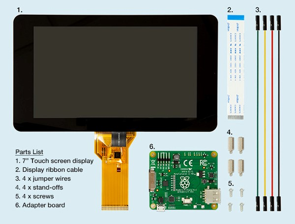|
|Step 2|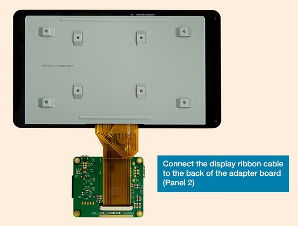|
|Step 3|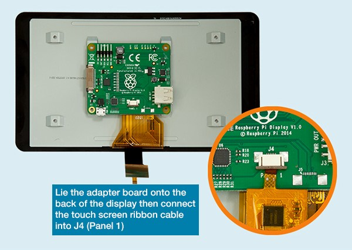|
|Step 4|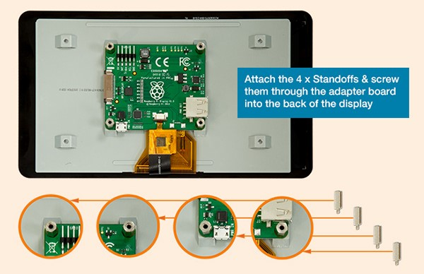|
|Step 5|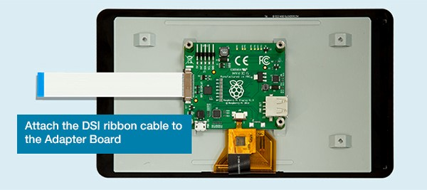|
|Step 6|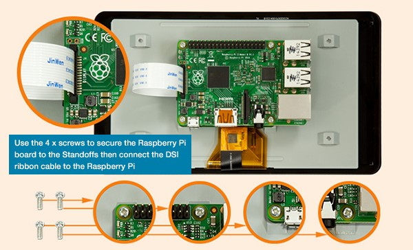|
|Step 7|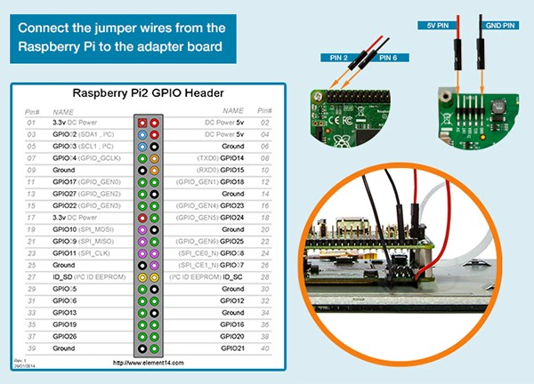|
|Step 8|Assembly of the standard display. (Make sure you have inserted the MicroSD card since you won’t have access to the slot as soon as you mounted the case!)Just pull the back plate off the case, insert the display including the mounted Raspberry (make sure that the path cables and the display cables are not crushed between case and board), tighten it with the 4 screws and put the back plate into place. Here is a good clip on YouTube: https://www.youtube.com/watch?v=wpSxibZOmoo|

---

# Chapter 4: Raspbian basic configuration
## Starting up Raspberry or the first time – Raspbian PIXEL desktop
Since this tutorial is focussing on using the PIXEL GUI here are a few basic tips.
### Raspberry start-up screen:

### PIXEL basic desktop (including the programs used in this tutorial) not unlike other PC OS desktops:
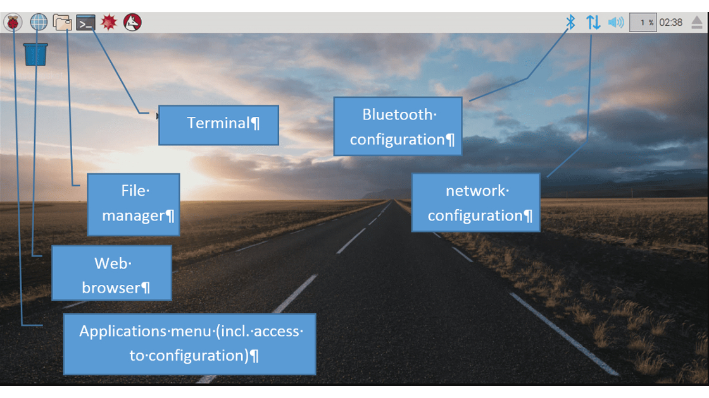

**NOTE:** If you are working with the 7” Raspberry display setup you might need to flip/rotate the display orientation. Just check the section” Optional: Change display orientation” later in this chapter
### Working with the Terminal:
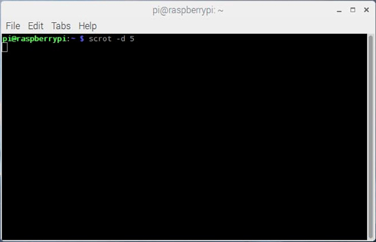

**NOTE:** As soon as you have connected the Raspberry to the network you might find it easier to open the Terminal remotely using PuTTY. This also allows you to directly paste command lines from this tutorial into the Terminal. (Right click in PuTTY terminal is pasting the content of the clipboard into the terminal)
#### Basic terminal commands and functions:
The full list can be found on:

https://www.Raspberrypi.org/documentation/linux/usage/commands.md

|Command|Description|
|---|---|
|`help`|Is showing you basic commands|
|`sudo *othercommand*`|is allowing you to run other commands as super user aka root user|
|`ls -la`|Shows the files in a directory incl. additional information|
|`cd`|Is changing the shell working directory. It can be used with attributes|
|`cd`|No attribute => working directory is changed to user root directory.|
|`cd ..`|Working directory is changed to directory one level above|
|`cd *directory*`|Working directory is changed to the named directory inside the current directory|
|`cd */directory/directory*`|Working directory is changed to the directory defined by the full path /directory/directory|
|`nano *filename*`|Is stating a basic editor in the terminal to open or create a simple text or configuration file. Closing the editor is done by ctrl+x and then choosing whether you want to save your changes or not|
|`sudo nano *filename*`|Is stating a basic editor with write access in the terminal to open or create a simple text or configuration file with root user rights. Closing the editor is done by ctrl+x and then choosing whether you want to save your changes or not|

## Initial configuration of Raspbian
The following steps make sure, that basic Raspbian configuration is done.

**NOTE:** There may be many tutorials in how to set-up and configure Raspbian and going into more details about user rights and other Raspbian features. This tutorial is showing the way which worked for my project aiming to run openHAB2 on the Raspberry.
Since this tutorial is using the PIXEL GUI I always refer to the PIXEL way of configuring and only go back to the terminal way (text only) if it is required.

### Localisation:
The first thing you want to do is changing the localisation settings to make sure your keyboard layout and WiFi settings are matching.

**NOTE:** Do not change the password before you have changed the keyboard layout since you might put in a different password than you expect (e.g. US qwerty vs. German qwertz results in “Raspberrz” instead of “Raspberry”)

|Description|Image|
|---|---|
|Open Raspberry Pi Configuration *>Application menu >>Preferences >>>Raspberry Pi configuration*|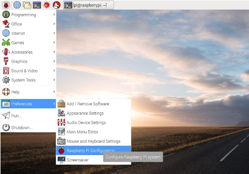|
|Configure *>Localisation >>Set Locale >>>Language >>>Country*|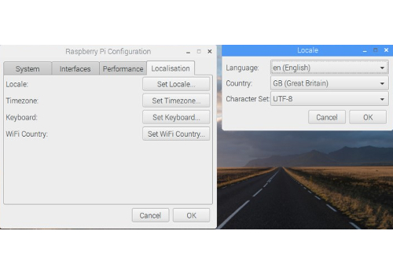|
|Go to tab Localisation *>Localisation >>Set Timezone >>>Area >>>Location*|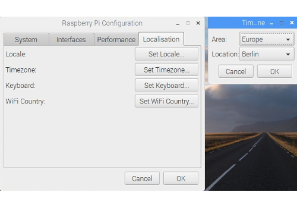|
|Go to tab Localisation *>Localisation >>Set Keyboard >>>Country >>>Variant*|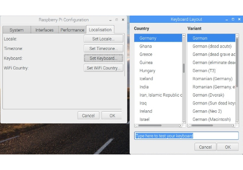|
|Go to tab Localisation *>Localisation >>Set WiFi Country >>>Country*|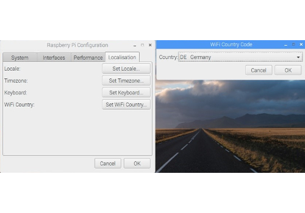|
|Accept the reboot||

### *Optional:* Change display orientation
If you are working with the 7” Raspberry display setup you might need to flip/rotate the display orientation for specific cases

|Description|Image/Command|
|---|---|
|Open Terminal|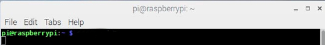|
|Open boot config.txt file in nano editor|`sudo nano /boot/config.txt`|
|Add the line at the bottom of the file:(This will flip the display orientation)|`lcd_rotate=2`|
|Optional: You can choose from different angles||
|0 degrees rotation|`display_rotate=0`|
|90 degrees rotation|`display_rotate=1`|
|180 degrees rotation|`display_rotate=2`|
|270 degrees rotation|`display_rotate=3`|
|horizontal flip|`display_rotate=0x10000`|
|vertical flip|`display_rotate=0x20000`|
|Exit and save the file|[ctrl+x] > `y` > [Enter]|
|Reboot the Raspberry for the changes to take effect|`sudo reboot`|
### Changing Password:
This is important to secure your standard Raspberry user “pi” before you connect the Raspberry to the network.

**NOTE:** Make sure you have changed the keyboard layout to your requirements before change the password.

|Description|Image/Command|
|---|---|
|Open Raspberry Pi Configuration *>Application menu >>Preferences >>>Raspberry Pi configuration*||
|Change the password *>System >>Change Password*|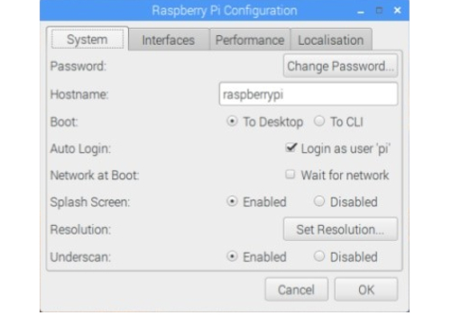|
|Enter initial (for standard user “pi” it is “*raspberry*” and your *new password*|`raspberry` > *`yourpassword`* > *`yourpassword`*|
### Enabling interfaces:
This is required for the communication to the PC (SSH) and to the Z-Wave stick (Serial)

|Description|Image/Command|
|---|---|
|Open Terminal||
|Enable SSH (to access the Raspberry via Network) Enable Serial (to enable Serial Port for Z-Wave controllers) *>Interfaces >>SSH >> Serial*|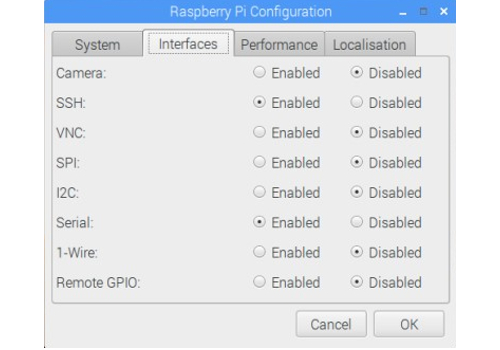 [SSH: Enable] & [Serial: Enable]|

### Connect Raspberry to network: 
Either by plugging in a Ethernet cable or by connecting to a WiFi network:

|Description|Image/Command|
|---|---|
|Click on the network symbol|*3 lines and 2 red crosses if no connection is available*|
|Select WiFi network|[yourwifi]|
|Enter WiFi password|*`yourwifipassword`*|

### Check the IP address of the Raspberry:
To do so you have to check the IP address of the Raspberry in the terminal:

|Description|Image/Command|
|---|---|
|Open Terminal||
|use the command|`ifconfig`|
|Result: the terminal shows you the ip configuration and the IP addresses for the different connections|Ethernet cable: [eth0] *`xxx.xxx.xxx.xxx`* or WiFi: [wlan0] *`xxx.xxx.xxx.xxx`*|

**NOTE:** You might want to set your IP address of the Raspberry to static, if you get problems with the lease time setting of your gateway (IP address is changing whenever you reconnect to the network)

### Update / Upgrade Raspbian:
Raspbian is proving online updates so make sure that you have the latest installed before you go further in the configuration.

|Description|Image/Command|
|---|---|
|Open Terminal||
|use the command (be aware that the upgrade function will take several minutes to complete if you run it for the first time) and confirm prompts with *Yes*|`sudo apt-get update` & `sudo apt-get upgrade`>`y`|

##Optional Raspberry settings and configuration:

The following settings and configuration is just for additional information and might not be needed to setup openHAB2. Some of the settings and configuration might still be useful.

### Check partition size on MicroSD card:
Make sure Raspbian is using the full capacity of the MicroSD card (normally while starting up Raspbian for the first time, it is done automatically and the Raspberry will restart automatically):

|Description|Image/Command|
|---|---|
|Open Terminal||
|use the command|`sudo fdisk -l`|
|Result: the terminal shows you the partition size of the two partitions on the MicroSD card summing up to the total capacity|
|If the capacity is not completely used (e.g. you were using not a plain Raspbian image) you have to expand the partitions manually in the terminal configuration ||
|Start terminal configuration with command|`sudo raspi-config`|
|Select Option (Be aware that the option numbers might change in newer Raspbian releases)|7 Advanced Options|
|Select Option|A1 Expand Filesystem Prompt will tell you that the file system has been increased|
|Now select to exit the configuration|[Finish]|
|Allow reboot|[Yes]|

### Create a Desktop icon and link it to a application 
To be able to create a Icon you have to first create a *yourdesktopfile*.desktop file
**NOTE**: This example is creating the desktop icon for the user “pi”

|Description|Image/Command|
|---|---|
|Open Terminal||
|Go to the directory desktop for your “pi” user|`cd /home/pi/Desktop`|
|Create a specific desktop file using nano editor|`sudo nano yourdesktopfile.desktop`|
|Enter parameters into the file accordingly|(see example file content below)|
|Name:|*YourShortcutName*|
|Comment:|*Your Shortcut Comment*|
|Icon:|*YourIcon.png*|
|Application for shortcut:|*YourShortcutApp*|
#### Example file content:
```bash
[Desktop Entry]
Name=YourShortcutName
Comment=Your Shortcut Comment
Icon=/usr/share/pixmaps/YourIcon.png
Exec=/usr/bin/YourShortcutApp
Type=Application
Encoding=UTF-8
Terminal=false
```

### Enabling root user:
Since by default the “root” disabled it can’t be used. You might want to enable it for certain purposes like e.g. enabling the root user for samba file server to get full access to the directories from a PC (see chapter setup samba server) 
**NOTE:** There is a reason for the “root” being disabled! Enabling the user is allowing full access to the Raspbian and therefore creating a security risk. Please always consider whether you really want to enable this user!

|Description|Image/Command|
|---|---|
|Open Terminal||
|Since the user already exists you just have to set the password. **NOTE:** you can also use the command to change the password later on|`sudo passwd root`|
|Just enter twice the new password for the “root” user|*`rootpassword`* *`rootpassword`* |

### Enabling remote SSH access for root user:
**NOTE:** There is a reason for the “root” not being enabled for SSH! Enabling the user for SSH is allowing full remote access to the Raspbian and therefore creating a significant security risk. Please always consider whether you really want to enable this user for SSH!

|Description|Image/Command|
|---|---|
|Open Terminal||
|Open sshd.config file in nano editor|`sudo nano /etc/ssh/sshd_config`|
|Find the section in the file|`# Authentication`|
||`LoginGraceTime 120`|
||`PermitRootLogin without-password`|
||`StrictModes yes`|
|Change the line|`PermitRootLogin yes`|
|Reboot the Raspberry for the changes to take effect|`sudo reboot`|

## Optional: Raspbian PIXEL screensaver (xscreensaver)
If you are working with the 7” Raspberry display setup you might want to use a screensaver as well.
Installation of xscreensaver:

|Description|Image/Command|
|---|---|
|Open Terminal||
|Install xscreensaver and some additional screen saver themes|`sudo apt-get install xscreensaver xscreensaver-data-extra xscreensaver-gl-extra`|
|Confirm installation|[Yes]|

### Configuration of xscreensaver:
I am showing an example configuration which is first switching on a screensaver and then turning off the display completely.

|Description|Image/Command|
|---|---|
|Open Screensaver Preferences: >Application menu >>Preferences >>>Screensaver|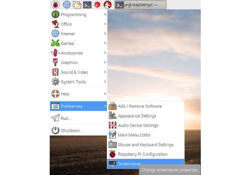|
|Configure [Display Modes] - NOTE: This is just a sample configuration selecting one screensaver after 5 minutes|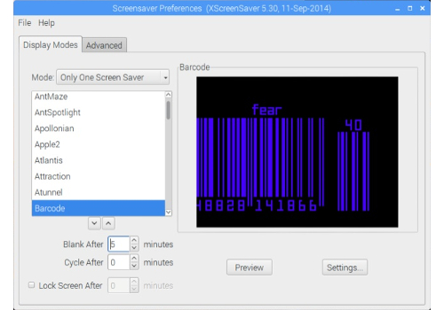|
|Mode|[Only One Screen Saver]|
|Screensaver|[Barcode]|
|Blank After|[5] minutes|
|Cycle After|[0] minutes|
|Configure [Advanced] - NOTE: This is just a sample switching off the screen after 10 minutes |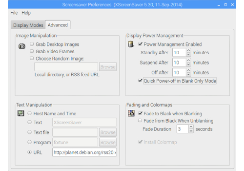|
|Power Management Enabled|[x]|
|Standby After:|[10] minutes|
|Suspend After:| [10] minutes|
|Off After:| [10] minutes|
|Quick Power-off in Blank Only Mode:|[x]|
|Close the Screensaver Preferences - NOTE: There is no save button||

## Optional: Start Chromium Web server on Raspbian boot

### Configure the autostart file:

|Description|Image/Command|
|---|---|
|Open Terminal||
|Open the autostart configuration file with nano editor|`sudo nano /home/pi/.config/lxsession/LXDE-pi/autostart`|
|Add the line at the end of the file |`@unclutter`|
|Add the line at the end of the file - (`--noerrdialogs` to ignor error dialogs)|`@chromium-browser --noerrdialogs`|
|Optional parameters (example command):|`@chromium-browser --noerrdialogs --kiosk --incognito http://yoururl.com`|
|For full screen mode. NOTE: to exit full screen mode you have to press “Alt+F4” on the keyboard of the Raspberry, so you have to have a keyboard installed to exit this mode!|`--kiosk `|
|For incognito mode of the browser|`--incognito`|
|For selecting the URL directly in the configuration file. NOTE: selecting the URL via Chromium settings might be easier|`http://yoururl.com`|
|Exit and save the file|[ctrl+x] > `y` > [Enter]|
|Reboot the Raspberry for the changes to take effect|`sudo reboot`|

### Select the start URL for Chromium web browser:
**NOTE:** You can also select the URL in the autostart file, but using the browser functionality is giving you a simpler access (no terminal) and you can check the result without rebooting

|Description|Image/Command|
|---|---|
|Open Chromium and go to the Settings(3 bullets icon)|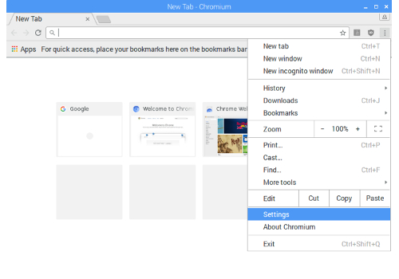|
|Enable in the *On start-up* chapter the option *Open a specific page or set of pages* [x] and click on the link [Set pages] to enter the requested start URL|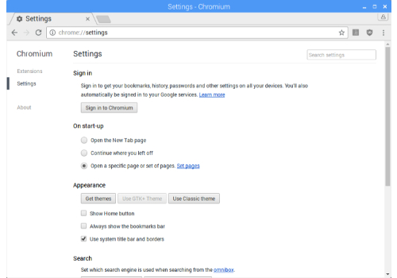|
|Enter the requested start URL `http://yoururl.com`, [OK] your URL - Now Chromium is allowing you to enter an additional URL which you can ignore|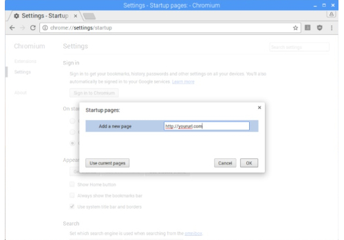|
|To check if it is working >Close Chromium browser >Open Chromium browser >>Result: `http://yoururl.com` should be loaded on startup ||
|Optional: If you have completed your openHAB2 configuration and want to use HABPANEL as GUI you can just use the URL or even start specific pages in the HABPANEL GUI (just use the URL shown in the browser when you access the HABPANEL page) - NOTE: If you are linking to pages hosted on the same raspberry, most likely ou will receive an error message since yon startup the service has not started up. Just refresh the page after a few minutes. |`http://xxx.xxx.xxx.xxx:8080/HABPANEL/index.html#/`|


# Chapter 5: Setting up Raspbian for access via PC
## Connect to the Raspberry terminal your windows system using, KiTTY or PuTTY:

|Description|Image/Command|
|---|---|
|Open KiTTY or PuTTY on your PC||
|Enter Hostname (pi@ in front of the IP is giving the user you want to use for connecting, in this case the standard user “pi”), Port and Connection type. Select Open to launch the terminal|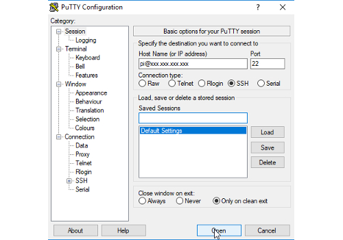|
|Optional: save the session|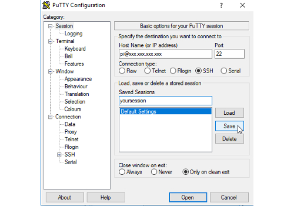|
|On first connection an security alert is coming which you have to accept|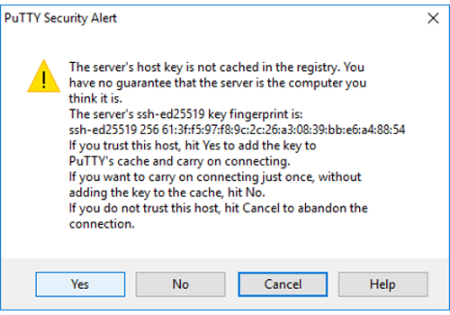|
|Now a terminal window is opening on our PC asking you to enter the “pi” user password|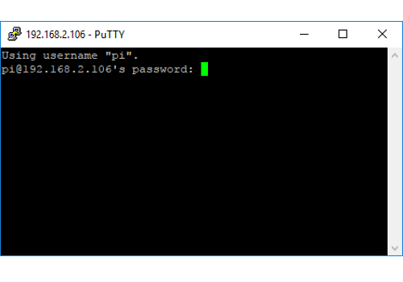|
|The terminal window is now starting up in the user home directory|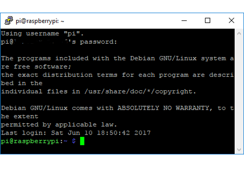|
|You can now use the PC terminal window the same way you us the terminal on the Raspberry itself||

## Optional: Connect to the Raspberry file system from your windows system using WinSCP:
**NOTE:** The connection can only access the rights of the Raspberry user. So the standard user “pi” will not have the writing rights for multiple directories. For full access you have to use the user “root” (user needs to be enabled since it is disabled in standard setup, procedure shown later in the tutorial), but enabling this user for SSH access is opening up a significant security risk, so it is recommended to use as Raspberry based Samba server for full access to specific directories (shown later in the tutorial).

|Description|Image/Command|
|---|---|
|Open WinSCP on your computer||
|Configure your session||
|Select|[New Site]|
|Select File protocol|[SCP]|
|Enter Host name|`xxx.xxx.xxx.xxx`|
|Enter port|`22`|
|Enter User name|`pi` (standard user with limited access to the file system)|
|Enter Password for “pi”|`yourpassword`|
|Optional: save the session|[Save]|
|WinSCP is launched showing the windows directory on the left side and the “pi” user home directory of the Raspberry on the right side of the window||

## Optional: Generic setup of Samba server on Raspbian
To have access to the Raspberry file system using the PC file explorer you have to install a Samba server on Raspbian. With the server installed you can map the selected folders (share) on your Raspberry as a network drive.
**NOTE:** Skip this section *to the end of this chapter*, if you only want to use the Samba server for openHAB2 purpose. You will find an openHAB2 centric installation guide later in this document. 

|Description|Image/Command|
|---|---|
|Open Terminal||
|Make sure Raspberry is updated (optional)|`sudo apt-get update`|
|Download samba server to Raspbery|`sudo apt-get install samba samba-common-bin`|
|Open the samba server configuration file in nano editor|`sudo nano /etc/samba/smb.conf`|
|Go to the end of the file and add following lines|`[RaspberryPiDirectories]`|
||`comment = Your full access to Raspberry Pi directories`|
|NOTE: / is setting the share to the root directory. You can share dedicated directories by detailing the path (e.g. /etc/openhab2) |`path = /`|
||`read only = no`|
|Optional: Change the workgroup name if needed, otherwise uncomment and enable WINS support in the section|`# Windows Internet Name Serving Support Section`|
||`# WINS Support - Tells the NMBD component of Samba to enable its WINS Server`|
||`wins support = yes`|
|Exit and save the file|[ctrl+x] > `y` > [Enter]|
|Now you have to activate a user, e.g. “pi” as a Samba user|`sudo smbpasswd -a pi`
|Now enter the password for the external access of the network share|`sharepwd` `sharepwd`|
|NOTE: The access to the selected folders (share) on your Raspberry will be limited to the user rights of the Raspbian user you activated as a Samba user.||
|Optional: Create a dedicated *sambausr*. This allows you to do a more precise rights management of the shared files on Raspbian. (Details how to manage access rights can be found online)||
|First you have to create the user in Raspbian|`sudo adduser sambausr`|
|Then you have to enter your password *sambausrpassword* and optional information you can just leave empty and finally save with `y`|Adding user sambausr' ...|
||Adding new group sambausr' (1001) ...|
||Adding new user sambausr' (1001) with group sambausr' ...|
||Creating home directory /home/sambausr' ...|
||Copying files from /etc/skel' ...|
||Enter new UNIX password:`sambausrpassword`|
||Retype new UNIX password:`sambausrpassword`|
||passwd: password updated successfully|
||Changing the user information for *sambausr*|
||Enter the new value, or press ENTER for the default|
||Full Name []:|
||Room Number []:|
||Work Phone []:|
||Home Phone []:|
||Other []:||
||Is the information correct? [Y/n] `y`|
|Then you have to activate the dedicated sambausr as a Samba user|`sudo smbpasswd -a sambausr`|
|Now enter the password for the external access of the network share|`sambausrsharepwd``sambausrsharepwd`|
|Mandatory:Check the syntax of the samba configuration file. Result: there should be no error message(red) in the prompt|`testparm`|
|Now you have to restart the services to reload the config file|`sudo systemctl restart smbd.service` `sudo systemctl restart nmbd.service`|
|Make sure that the services are running again without errors|`sudo systemctl status smbd.service` `sudo systemctl status nmbd.service`|


|Command|Description|
|---|---|
|`sudo systemctl status smbd.service` `sudo systemctl status nmbd.service`|Check if all the services are running|
|`sudo systemctl restart smbd.service` `sudo systemctl restart nmbd.service`|Restart the samba services|
|`sudo systemctl stop smbd.service` `sudo systemctl stop nmbd.service`|Manually stop the samba services|
|`sudo smbpasswd -a sambausr`|Create a new Samba user mapping|
|`sudo smbpasswd -d sambausr`|Disable a Samba user|
|`sudo smbpasswd -e sambausr`|Enable a Samba user|

### Optional: Mapping Raspbian samba directories to Windows (IOS and Linux mapping process can be found online):

|Description|Image/Command|
|---|---|
|One time map the Raspberry folder to a windows drive (in this case Z) enter in the CMD Prompt (just put CMD in the search of Windows 10 to open the command prompt)|`net use Z: \\xxx.xxx.xxx.xxx\RaspberryPiDirectories /user:sambausr sambausrpassword /persistent:no`|
|Persistent map the Raspberry folder to a windows drive (in this case Z) enter in the CMD Prompt (just put CMD in the search of Windows 10 to open the command prompt)|`net use Z: \\xxx.xxx.xxx.xxx\RaspberryPiDirectories /user:sambausr sambausrpassword /persistent:yes`|
|You can also create a simple .bat file for easy double clicking. Open the editor by just putting notepad in the search of Windows 10. Enter the line. Save as *yourmapping*.bat|`net use Z: \\xxx.xxx.xxx.xxx\RaspberryPiDirectories /user:sambausr sambausrpassword /persistent:no`|

# Chapter 6: Installation of openHAB2 on Raspberry
This tutorial is only focussing on the package repository installation of the stable version and only on the add-ons for the listed hardware.
All other installations are described on the openhab.org site installation for Linux: *http://docs.openhab.org/installation/linux.html#package-repository-installation* For the Raspbian you have to go for the “Apt Based Systems” part of it.


First, add the openHAB2 bintray repository key to your package manager and allow Apt to use the HTTPS Protocol
``` bash
wget -qO - 'https://bintray.com/user/downloadSubjectPublicKey?username=openhab' | sudo apt-key add -
```
```bash
sudo apt-get install apt-transport-https
```
I choose the stable Official (Stable) build.
The stable builds contain the latest official release with tested features.
```bash
echo 'deb https://dl.bintray.com/openhab/apt-repo2 stable main' | sudo tee /etc/apt/sources.list.d/openhab2.list
```
Next, resynchronize the package index:
```bash
sudo apt-get update
```
Now install openHAB2 with the following command:
```bash
sudo apt-get install openhab2
```
*Optional but recommended:* When you choose to install an add-on, openHAB2 will download it from the internet on request. If you plan on disconnecting your machine from the internet, then you will want to also install the add-ons package.
```bash
sudo apt-get install openhab2-addons
```
Since we were installing the stable version, we have to manually add the binding WIFILED used for the WiFi LED controller manually to the system.
First you have to change to the add-ons directory.
Than you have to download the latest version of the binding directly from the online repository
*Remark: Later, this binding will not be available in the PAPER UI GUI under the Add-ons/Bindings tab, but will show up in the configuration/bindings tab.*

```bash
cd /usr/share/openhab2/addons
sudo wget https://openhab.ci.cloudbees.com/job/openHAB2-Bundles/lastSuccessfulBuild/org.openhab.binding%24org.openhab.binding.wifiled/artifact/org.openhab.binding/org.openhab.binding.wifiled/2.1.0-SNAPSHOT/org.openhab.binding.wifiled-2.1.0-SNAPSHOT.jar
```
If everything went well, you can start openHAB2 and register it to be automatically executed at system startup:
```bash
sudo systemctl start openhab2.service
sudo systemctl status openhab2.service

sudo systemctl daemon-reload
sudo systemctl enable openhab2.service
```
## Common openHAB2 service commands:

|Command|Description|
|---|---|
|`sudo systemctl status openhab2.service`|Shows the status of openHAB2|
|`sudo systemctl start openhab2.service`|Start the service of openHAB2|
|`sudo systemctl stop openhab2.service`|Stops the service of openHAB2|
|`sudo systemctl restart openhab2.service`|Restarts the service of openHAB2|
|`sudo apt-get purge openhab2`|This commands uninstall openHAB2 from your Raspbian|
|`sudo rm /etc/apt/sources.list.d/openhab2.list`|and delete the source list|

## openHAB2 configuration for the samba server:
This is required to grant the PC based Eclipse Smart Home Designer access to the requested configuration folder on your Raspbian.
**NOTE:** This is for using samba for openHAB2 ONLY. If you already have set up a samba with a different user and a full access to raspberry, this might be obolete.

|Description|Image/Command|
|---|---|
|Open Terminal||
|The shares are configured to be not open for guests nor to the public. Let’s activate the “openhab” user as a samba user|`sudo smbpasswd -a openhab`|
|Enter the password *openhabpassword* which will be used to map the share on your PC|`New SMB password:`|
||`Retype new SMB password:`|
||`Added user openhab.`|
|Be aware, that creating and later using a specific user will ensure that permissions are honoured. Make sure, the “openhab” user has ownership and/or write access to the openHAB2 configuration files. This can be accomplished by executing:|`sudo chown -hR openhab:openhab /etc/openhab2`|
|Restart the samba service to allow the changes to be utilized|`sudo systemctl restart smbd.service`|
|Map the Raspberry folder to a windows drive (in this case Z) enter in the CMD Prompt (just put CMD in the search of Windows 10 to open the command prompt)|`net use Z: \\xxx.xxx.xxx.xxx\RaspberryPiDirectories /user:openhab openhabpassword /persistent:no`|


## openHAB2 Privileges for Common Peripherals
An openHAB2 setup will often rely on hardware like a modem, transceiver or adapter to interface with home automation hardware. Examples are a Z-Wave, Enocean or RXFcom USB Stick or a Raspberry Pi add-on board connected to the serial port on its GPIOs. In order to allow openHAB2 to communicate with additional peripherals, it has to be added to corresponding Linux groups. The following example shows how to add Linux user openHAB2 to the often needed groups dialout and tty. Additional groups may be needed, depending on your hardware and software setup.

### Adding openhab user to groupds dialout an tty

|Description|Image/Command|
|---|---|
|Open Terminal||
|Enter command (This is adding the openhab user to the group dialout)|`sudo adduser openhab dialout`|
|Enter command (This is adding the openhab user to the group tty)|`sudo adduser openhab tty`|
|Optional: Enter command (If you are looking to enable sound privileges for openHAB2, it will also be necessary to add openHAB2 to the “audio” group.)|`sudo adduser openhab audio`|

### Granting java environment access to serial ports

|Description|Image/Command|
|---|---|
|Open Terminal||
|Change to directory|`cd /etc/default/`|
|Open openhab2 file in nano editor|`sudo nano openhab2`|
|Change the text from (nothing between the “”)|`EXTRA_JAVA_OPTS=""`|
|To (something between the “”)|`EXTRA_JAVA_OPTS="-Dgnu.io.rxtx.SerialPorts=/dev/ttyUSB0:/dev/ttyS0:/dev/ttyS2:/dev/ttyACM0:/dev/ttyAMA0"`|
|Exit and save the file|[ctrl+x] > `y` > [Enter]|
|Reboot the Raspberry for the changes to take effect|`sudo reboot`|

```bash
```

-
-

---


# Markdown syntax examples start from here:

---
General header
---


Github specific syntax
```
Fenced Code
```

```bash
Fenced code bash highlighting

```

~~Strikethrogh~~

- [ ] Tasklist
- [ ] Tasklist


# Header 1
## Header 2
### Header 3
#### Header 4
##### Header 5
###### Header 6

**Strong-Bold**

*Emphasize*

`inline code`


[link](https://community.openhab.org/)

> Blockquote
>> Blockquote
>>> Blockquote

1. Ordered List
2. Ordered List

- Unordered List
- Unordered List

Page Break before
* * *
Page Break after

Section Break before
- - -
Section Break before

Sentence Break before
_ _ _
Sentence Break before

<!--This is a comment-->


| column     | column     | column     |
|:---|:---:|---:|
|            |            |
|left       |centered   |right|
|  -  |     -    | - |


|text|picture|
|---|---|
|blabla||


