

---
openHAB2 Raspberry beginner’s walkthrough – Using Raspberry Pi 3 and openHAB2 to create a home automation controller for Z-Wave, WiFi LED, 433MHz plugs, Yahoo Weather and meteoblue.com weather widget 
---

# Chapter 1: Before you start
## Is openHAB2 the right choice for my home automation project?
Be aware that openHAB2 is an OPEN home automation solution which is strongly living from a very supportive community. If you want to have a plug and play solution with supplier guaranteed service level and a high likeliness that all the features are working and all the hardware is compatible, you might be better off in getting a ready to use home automation kit including the designated controller (like e.g. devolo or homematic IP). Consider this especially if you are planning to do safety related automation or emergency detection like fire alarm. 
If you, on the other hand, are willing to spend a few hrs/days in learning how to do a little installation and coding yourself and have no problems with the service level of a Raspberry Pi 3 (it is not as failsafe as other controllers) you might find a perfect environment with openHAB2 for your low cost, very flexible and continuously improving home automation environment.

## Introduction:
This tutorial is targeting beginners like me to get a step by step guideline to get all the things installed. Since I am no coding expert and have no experience in Raspberry and Raspbian I am trying to go through the things step by step, so you should be able to get everything done, even without exactly having to go into all the details. That is one of the reasons I am also using the graphical GUI PIXEL for Raspbian since I think it makes it easier for the beginners to get started (and you might want to use PIXEL anyway when you are using the Raspberry 7” display as interface for your home automation controller)
This tutorial is also based on **having a Windows PC** to support the setup process. You might be able to completely do it without the support of an extra PC, if you can get a MicroSD card with a pre-installed Raspbian OS and use the display options (the Raspberry 7” display or HDMI Display) for the Raspberry.

***DISCLAIMER:
This tutorial might contain some typos, errors or ways of setting up, which can be done in a better way. I am just reflecting my process of starting from scratch and slowly working my way through hundreds of online tutorials, manuals, forum threads etc. and on the way, highlighting the issues I had in getting things working. There will be no guarantee that the given instructions are working for your project as well.***

Anyway I hope this tutorial will help some beginners to enjoy home automation with openHAB2.

## A few words about the 2 in openHAB2:
The 2 in openHAB2 is important! The tutorial is based on the openHAB2 and will not go into all the details of the old version.
You just have to be aware, that a lot of online documentation is still for the openHAB version and will not be applicable for openHAB2!
So the best thing is always to go to the official webpage of openHAB2 and start from there, and only if you really can’t find the information or the link there, go to google and search for other solutions. I was always using the search setting (last year) so it was more likely to the results considering openHAB2 and not openHAB.

---
# Chapter 2: Preparation
Shopping list:
As mentioned before, I am basing this tutorial on the graphical GUI of Raspbian named PIXEL so the shopping list is also containing parts for this optional setup:

## Hardware list:
### Minimal hardware setup of the controller with external display:

|Description|Image|
|---|---|
|Raspberry Pi 3||
|MicroSD card 16GB (minimal to have some buffer for the future) Make sure you have the right card reader to plug the MicroSD card into your computer!||
|Designated Raspberry power supply (min. 2,5A 5V, I recommend 3A) Do not use other USB chargers since insufficient power supply (shown in GUI as lightening symbol in the upper right corner) will result in serious issues like e.g. Bluetooth not working) A cable switch might be a good thing since you might have to hard-reset your Pi in the early days more often and the Pi itself does not have a power switch||
|USB Mouse||
|USB Keyboard||
|HDMI cable, full size to whatever your display needs (Obsolete, if you going for the 7” Raspberry display setup)||
|Display with HDMI input (Obsolete, if you going for the 7” Raspberry display setup)||
|*Optional:* Raspberry case (Obsolete, if you going for the 7” Raspberry display setup)||
|*Optional:* Ethernet cable (Obsolete, if you not want to use WiFi to connect the Raspberry to your gateway)||

### Additional hardware for optional setup of the controller with 7” Raspberry display:
(I found it very useful to have one permanent GUI interface mounted on your controller, you can also use this touchscreen interface directly to interact with your home automation):

|Description|Image|
|---|---|
|Raspberry Pi 7" Touch-Display||
|Premium case for Raspberry Pi 7" Touch-Display (closed version) often sold in bundle with Touch-Display, should be available in black, white and transparent. This is a very good case if you want to place the controller on a table or counter since it is protecting the Raspberry from the back.||
|*Alternative:* Cases for Raspberry Pi 7" Touch-Display. You will find a wide range of other cases. The open versions might give you a better access to the Pi GPIO pins or for changing SD card. Please consider: since you can rotate the image of the GUI on the display you can also choose to switch from landscape to portrait orientation.||
|Bluetooth keyboard (optional, since the optional on screen touch keyboard for Raspbian PIXEL was not working without errors, I decided to go for a Bluetooth keyboard which makes the typing much easier)||

### Z-Wave Controller hardware
If you want to use the Z-Wave technology for your home automation project you have to have one Z-Wave controller connected to your Raspberry
**NOTE:** Be aware that the details serial numbers or item names may vary since you have to always make sure to use the hardware which is allowed in your country!

|Description|Image|
|---|---|
|UZB Z-Wave PLUS USB stick by Z-Wave.Me *Pros:* Cheapest controller, small. *Cons:* For inclusion, the controller has to be plugged into the Raspberry, so for mounted devices like wall switches , you have to take the Raspberry in close proximity of the device or do the inclusion before you mount the switch inside the wall.||
|*Alternative:* Aeotec by Aeon Labs Z-Stick Gen5 *Pros:* Allows offline inclusion of Z-Wave devices which makes it very easy since you only have to take the stick to the mounted device, not the entire Raspberry. *Cons:* Including battery powered devices into openHAB2 requires a special process and might cause errors(see tutorial]||
|*NOT REALLY an Alternative:* Z-Wave Z-Wave.Me Razberry 2 Daughter Card for Raspberry Pi Home Automation (not plug and play compatible with optional setup of the controller with 7” Raspberry display!)*Pros:*	will be mounted directly on the Raspberry so it is not using a USB port *Cons:*	will be mounted directly on the Raspberry which is blocking the GPIO pins for e.g. the Display power supply or additional cooling fans, so you have to manually solder the power wires at the back of the razberry. Is using the i/o port of the Raspberry Pi 3 on board Bluetooth, so a lot of additional configuration is needed to get the razberry and the Bluetooth running in parallel. Most expensive controller.||

### Z-Wave sensors, switches and actuators

**NOTE:** Be aware that the details serial numbers or item names may vary since you have to always make sure to use the hardware which is allowed in your country!
Since I am doing a German based home automation project you may find that some Z-Wave devices are not sold in your required country configuration ( e.g. Z-Wave NodOn Smart Plug not available e.g. in the US)

*** This list is showing you all the devices I was testing. Your shopping list hast to be adopted to the desired setup of your project. You might have to alter some parts in this walkthrough (things, items, rules etc.) accordingly to your hardware list.***

|Description|Image|
|---|---|
|Z-Wave Fibaro Double Switch 2 FIBEFGS-223, Z-Wave Plus Smart Switch (comes at almost the same costs than the single switch and gives you 2 channels. (2x1500W) Only reason to go for single switch is you need the full power range of the single switch since the double switch has slightly lower range) *NOTE:* This switch is designed to be installed in the electrical power wiring of your home (inside a distributor case). In some countries this may only be allowed to be done by special trained staff (insurance and/or law).||
|Z-Wave Fibaro Single Switch 2 FIBEFGS-213 (1x 2500W)|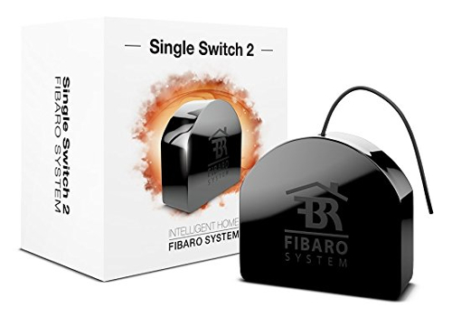|
|Aeotec Multi-Sensor 6 ZW100-C - Z-Wave Plus||
|Aeon Multi Sensor Gen5|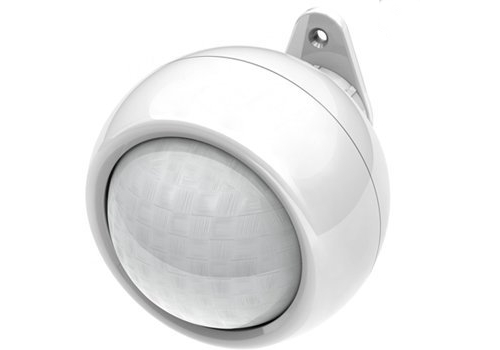|
|devolo Home Control door sensor (it also provides you with raw temperature and lumincance readings)||
|ZME_WALLC-S multi swith by Z-Wave.me|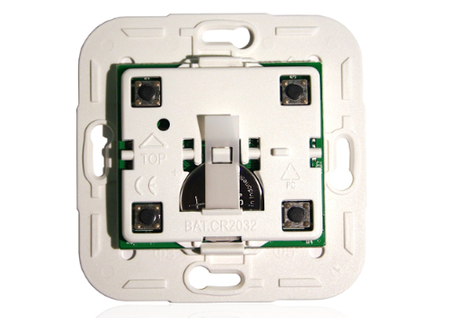|
|Z-Wave Aeon Labs ZW088 Z-Wave Key Fob, Gen5||
|Z-Wave NodOn Smart Plug (not available e.g. in the US)||
|*Alternative:* Fibaro wall plug FIBEFGWPF-102 (allows you to switch up to 2500W)||

**NOTE:** If you want to by other Z-Wave devices always make your they are listed in the Z-Wave device list of the openHAB2 Z-Wave binding to make sure they are supported correctly in the context of openHAB2:

**http://www.cd-jackson.com/index.php/zwave/zwave-device-database/zwave-device-list**

### LAN devices (cable or WiFi)
A lot of things you are using at home are already connected to your LAN and can be integrated into your openHAB2 home automation project if the right binding is available for that device.
You can find an overview on

**http://docs.openhab.org/addons/bindings.html**

**NOTE:** Be aware that not all the bindings to include devices are already included in the stable version of openHAB2 and may require a manual installation of a so called snapshot version of the binding (how to install snapshot bindings is explained later in this tutorial since we will need it for the WiFi LED controller)

|Description|Image|
|---|---|
|WiFi XCSOURCE Magic UFO-WiFi LED-Controller Type LD382 (other brand names might work as well, but you have to make sure it is Type LD382, LD382A or LD686) *REMARK:* I was using a WiFi controller on purpose since: It is only about half the price of a Z-Wave WiFi controller. You can control the device as well via smart phone (like light to music feature of the app). But some things you have to be aware of using WiFi LED instead of Z-Wave LED: You have to have a WiFi network to which your Raspberry and your WiFi LED controller is connected. You have to manually install a beta / snapshot version of openHAB2 or manually install the WiFi LED Binding on top of the package based installation of openHAB2 (see tutorial).||
|RGB LED stripe incl. power supply 12V DC bundle. While you can buy the stripe and the power supply bundle separately, most of the times the bundle will come at the same price or even cheaper. The included power supply plug should directly fit into the power inlet socket of the WiFi controller. *REMARK:* It also allows you to attach the stripe without soldering since you can just cut the cable of the RGB bundle controller and use it to connect the LED stripe to the WiFi controller.||
|*Optional:* White LED stripe. Since the WiFi LED-Controller is allowing you to at additionally control plain colour LED stripe (or in case of controller type LD686 even two) you might want to get an additional strip in e.g. plain white to create ab clear white illumination. *NOTE:* You might be fine with just the stripe if you already got the power supply with the RGB stripe||
|*Optional(in my case it was already there and I just included it into my project):* Yamaha Receiver RX-V581||

### 433MHz devices
**NOTE:** Be aware that the details serial numbers or item names may vary since you have to always make sure to use the hardware which is allowed in your country!

|Description|Image|
|---|---|
|433MHz Transmitter / Receiver bundle|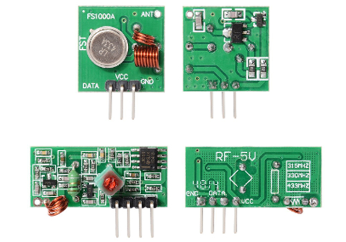|
|433MHz Antenna (purchase)||
|*Optional:* 433MHz Antenna (DIY) 173 mm (6,81 in) wire (I used an insulated tie wire). Coil the antenna wire around a pen/chopstick|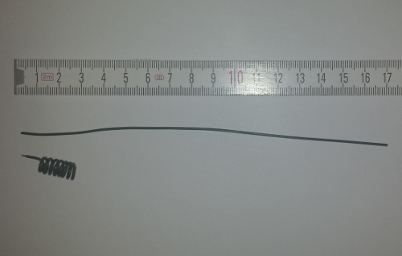|
|Jumper cables (Female-Female)|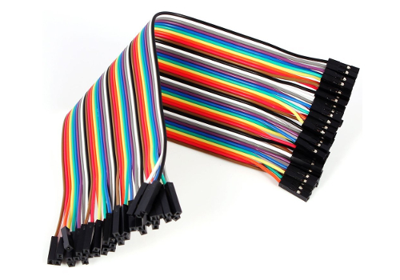|
|433MHz Plug sets like *Brennenstuhl RCS 1000 N Comfort* or *Elro AB440S* (In my case I was able to use existing devices of other brands as well)|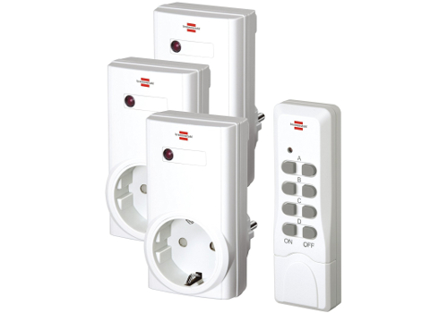|
|*Optional:* 433MHz Plug sets supporting the code selection by 10 bit dip switches |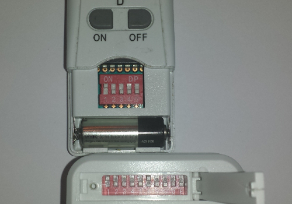|
|*Optional:* 433MHz Plug sets with other code selection or predefined codes|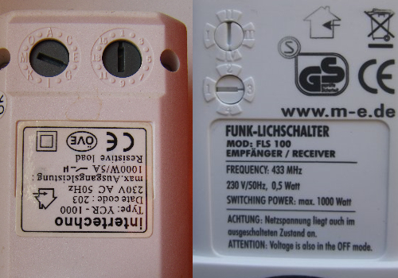|

## Software list:

**NOTE:** This list is just an overview. The details in how to download and install the software are included later in the document so **don't start downloading now**.

### Windows Download list:

My tutorial is using a MS-Windows windows machine for the PC part (You should be able to get it done with Mac or Linux PCs as well, but you have to go online to look up the differences and do some adaptions on the tutorial e.g. mounting the Raspberry file system to PC)

|Description|URL|
|---|---|
|The latest **Raspbian** (Raspberry OS) image. You have to download the “Raspbian Jessie with PIXEL - Image with PIXEL desktop based on Debian Jessie” since this tutorial is using PIXEL|**https://www.Raspberrypi.org/downloads/Raspbian/**|
|**Etcher** (to write the Raspbian image to the SD-Card)|**https://etcher.io/**|
|**Eclipse Smart HomeDesigner** (optional but strongly recommended for easy editing of OpenHAB2 configuration files; incl. syntax highlighting). You have to choose the right version for your PC|**https://www.openhab.org/downloads.html**|
|To use Eclipse Smart HomeDesigner you need **Java Runtime Environment JRE** (if not already installed on your PC)|**https://java.com/**|
|**PuTTY** or **KiTTY** portable to access the Raspberry console from your PC|**http://www.putty.org/** or **https://portableapps.com/apps/internet/kitty-portable**|
|**WinSCP** portable to access Raspberry file System directly from your PC (might become obsolete if you use a SAMBA server on your Raspberry, see tutorial)|**https://winscp.net/eng/download.php**|

### Raspberry downloads:
How to download software will be explained in the tutorial, but as a reference you will use:
- **openHAB2** Package repository based installation or manual installation (be aware that the file locations on the Raspberry will be different based on which kind of installation you choose)
- **Samba** server (for access of Raspberry files from Windows machine; needed for Eclipse Smart HomeDesigner)
- **git-core** to get code from the git repository (needed for the 433MHz controller)
- **wiringPi** to send commands using via GPIO (needed for the 433MHz controller)
- **433Utils** to communicate with the 433MHZ controller (needed for the 433MHz controller)
- **xscreensaver** (optional if you are using the display setup, to easy control screen blackening or screen savers)

---

# Chapter 3: Raspberry hardware and Raspbian OS installation
## General information about Raspberry interfaces and GPIO pins:
### Raspberry input Overview:


### Raspberry GPIO pin Overview:


### Preparing MicroSD card - writing Raspbian image to MicroSD card (PC required):
|Description|Image|
|---|---|
|Download latest Raspbian Release (*.zip file) to a Windows folder||
|Extract *latestimage*.zip file to receive *latestimage*.img file||
|Use Etcher to write image to a MicroSD card: 1. select image 2. select drive with MicroSD card plugged in to 3. start flashing||

### Connecting the hardware to the Raspberry
#### Basic hardware setup:
|Description|Image|
|---|---|
|Connect keyboard, mouse and Z-Wave controller to the USB ports||
|Insert the MicroSD card (pins facing the circuit board)||
|Connect Raspberry with display using HDMI (Obsolete, if you going for the 7” Raspberry display setup)||
|Connect the Raspberry with Ethernet cable to your gateway (optional)||
|Connect the power supply to the micro USB power input **Make sure that you have everything plugged in and the Raspberry is clear of any metal items since this step is already powering up your Raspberry.**||

#### 433MHz devices preparation and setup:

Solder the 433MHz antennas to the circuit boards of the transmitter and receiver:

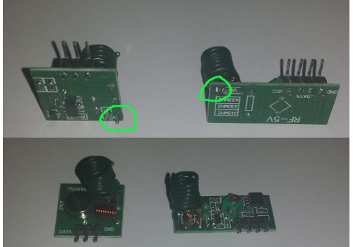

Connect the transmitter and receiver according to the wiring table below:

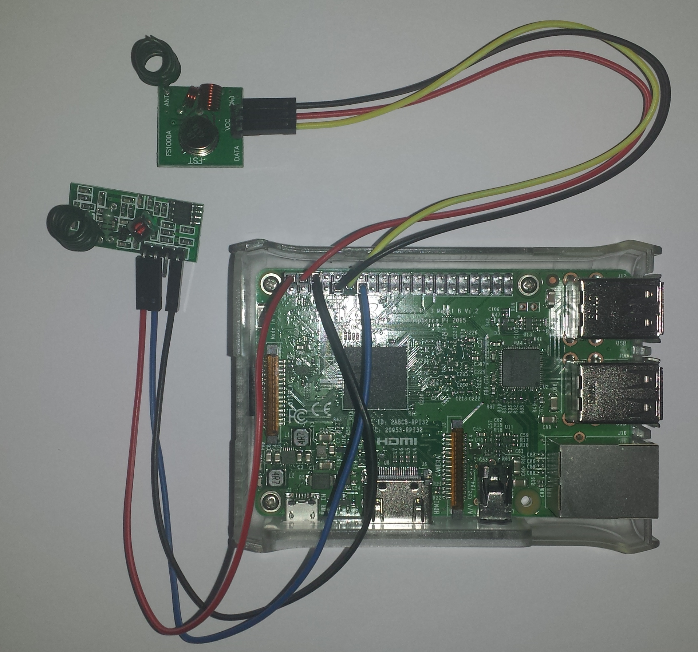

##### 433MHz Transmitter
|Transmitter Pin|Raspberry pin number|Raspberry pin name|
|---|---|---|
|GND|9|GND|
|VCC|4|5V PWR|
|DATA|11|GPIO 17|

##### 433MHz Receiver (permanently)
**NOTE:** If you are running the 7” Raspberry display setup, you will not be able to connect the receiver permanently since the display is using the same power supply pins. You will have to build (solder) yourself a Y-patch cable to fit into the display cover (A breadbord might not fit into the case). But be aware that a temporarily installation of the receiver will work as well for this setup. See section *433MHz Receiver (temporarily)*.

|Receiver Pin|Raspberry pin number|Raspberry pin name|
|---|---|---|
|GND|6|GND|
|VCC|2|5V PWR|
|DATA|13|GPIO 27|

##### 433MHz Receiver (temporarily)
**NOTE:** Sice we do need the receiver only in the setup process for reading the code of unknown 433MHz remote controls you might **not** need the receiver installed permanently.

If you have to read codes from a unknown 433MHz remote control you can temporarily use the power sockets of the transmitter. How to read the codes will be explained later in the section *Adding 433MHz things*. 

|Receiver Pin|Raspberry pin number|Raspberry pin name|
|---|---|---|
|GND|9|GND|
|VCC|4|5V PWR|
|DATA|13|GPIO 27|

After reading the codes you can remove the receiver completely from your raspberry and reconnect the transmitter to the power supply pins.


### Optional: Installation of 7” Raspberry display and display case:
The full tutorial will be found on:

**https://www.element14.com/community/docs/DOC-78156/l/Raspberry-pi-7-touchscreen-display**

and a clip on YouTube:

**https://www.youtube.com/watch?v=tK-w-wDvRTg**

**Remark:** I had an issue with plugging in the power supply to the micro USB power input on the circuit board of the display (like shown in the video). The Raspberry was still showing me the low power symbol (lightening symbol on the upper right corner) SOLUTION:  I had to plug in the power supply to the micro USB power input on the Raspberry itself. The display is now powered via the jumper cables. The standard display case is also allowing for both micro USB power inputs to be used.

**NOTE:** If the image on the display is having the wrong orientation, you can rotate the image by changing the configuration of Raspbian (see tutorial section Initial configuration of Raspbian > *Change display orientation*)

#### Display installation pictures:

Step 1:


Step 2:


Step 3:


Step 4:


Step 5:


Step 6:


Step 7:


Step 8: Assembly of the standard display. (Make sure you have inserted the MicroSD card since you won’t have access to the slot as soon as you mounted the case!)Just pull the back plate off the case, insert the display including the mounted Raspberry (make sure that the path cables and the display cables are not crushed between case and board), tighten it with the 4 screws and put the back plate into place. Here is a good clip on YouTube: **https://www.youtube.com/watch?v=wpSxibZOmoo**

---

# Chapter 4: Raspbian basic configuration
## Starting up Raspberry or the first time – Raspbian PIXEL desktop
Since this tutorial is focussing on using the PIXEL GUI here are a few basic tips.
### Raspberry start-up screen:


### PIXEL basic desktop (including the programs used in this tutorial) not unlike other PC OS desktops:


**NOTE:** If you are working with the 7” Raspberry display setup you might need to flip/rotate the display orientation. Just check the section” Optional: Change display orientation” later in this chapter
### Working with the Terminal:


**NOTE:** As soon as you have connected the Raspberry to the network you might find it easier to open the Terminal remotely using PuTTY. This also allows you to directly paste command lines from this tutorial into the Terminal. (Right click in PuTTY terminal is pasting the content of the clipboard into the terminal)
#### Basic terminal commands and functions:
The full list can be found on:

**https://www.Raspberrypi.org/documentation/linux/usage/commands.md**

|Command|Description|
|---|---|
|`help`|Is showing you basic commands|
|`sudo *othercommand*`|is allowing you to run other commands as super user aka root user|
|`ls -la`|Shows the files in a directory incl. additional information|
|`cd`|Is changing the shell working directory. It can be used with attributes|
|`cd`|No attribute => working directory is changed to user root directory.|
|`cd ..`|Working directory is changed to directory one level above|
|`cd *directory*`|Working directory is changed to the named directory inside the current directory|
|`cd */directory/directory*`|Working directory is changed to the directory defined by the full path /directory/directory|
|`nano *filename*`|Is stating a basic editor in the terminal to open or create a simple text or configuration file. Closing the editor is done by Ctrl+x and then choosing whether you want to save your changes or not|
|`sudo nano *filename*`|Is stating a basic editor with write access in the terminal to open or create a simple text or configuration file with root user rights. Closing the editor is done by [Ctrl+x] and then choosing whether you want to save your changes or not|

## Initial configuration of Raspbian
The following steps make sure, that basic Raspbian configuration is done.

**NOTE:** There may be many tutorials in how to set-up and configure Raspbian and going into more details about user rights and other Raspbian features. This tutorial is showing the way which worked for my project aiming to run openHAB2 on the Raspberry.
Since this tutorial is using the PIXEL GUI I always refer to the PIXEL way of configuring and only go back to the terminal way (text only) if it is required.

### Localisation:
The first thing you want to do is changing the localisation settings to make sure your keyboard layout and WiFi settings are matching.

**NOTE:** Do not change the password before you have changed the keyboard layout since you might put in a different password than you expect (e.g. US qwerty vs. German qwertz results in “Raspberrz” instead of “Raspberry”)

|Description|Image|
|---|---|
|Open Raspberry Pi Configuration *>Application menu >>Preferences >>>Raspberry Pi configuration*||
|Configure *>Localisation >>Set Locale >>>Language >>>Country*||
|Go to tab Localisation *>Localisation >>Set Timezone >>>Area >>>Location*||
|Go to tab Localisation *>Localisation >>Set Keyboard >>>Country >>>Variant*||
|Go to tab Localisation *>Localisation >>Set WiFi Country >>>Country*||
|Accept the reboot||

### Changing Password:
This is important to secure your standard Raspberry user “pi” before you connect the Raspberry to the network.

**NOTE:** Make sure you have changed the keyboard layout to your requirements before change the password.

|Description|Image/Command|
|---|---|
|Open Raspberry Pi Configuration *>Application menu >>Preferences >>>Raspberry Pi configuration*||
|Change the password *>System >>Change Password*||
|Enter initial (for standard user “pi” it is “*raspberry*” and your *new password*|`raspberry` > *`yourpassword`* > *`yourpassword`*|
### Enabling interfaces:
This is required for the communication to the PC (SSH) and to the Z-Wave stick (Serial)

|Description|Image/Command|
|---|---|
|Open Raspberry Pi Configuration *>Application menu >>Preferences >>>Raspberry Pi configuration*||
|Enable SSH (to access the Raspberry via Network) Enable Serial (to enable Serial Port for Z-Wave controllers) *>Interfaces >>SSH >> Serial*| [SSH: Enable] & [Serial: Enable]|

### Connect Raspberry to network: 
Either by plugging in a Ethernet cable or by connecting to a WiFi network:

|Description|Image/Command|
|---|---|
|Click on the network symbol|*3 lines and 2 red crosses if no connection is available*|
|Select WiFi network|[yourwifi]|
|Enter WiFi password|*`yourwifipassword`*|

### Check the IP address of the Raspberry:
To do so you have to check the IP address of the Raspberry in the terminal:

|Description|Image/Command|
|---|---|
|Open Terminal||
|use the command|`ifconfig`|
|Result: the terminal shows you the ip configuration and the IP addresses for the different connections|Ethernet cable: [eth0] *`xxx.xxx.xxx.xxx`* or WiFi: [wlan0] *`xxx.xxx.xxx.xxx`*|

**NOTE:** You might want to set your IP address of the Raspberry to static, if you get problems with the lease time setting of your gateway (IP address is changing whenever you reconnect to the network)

### Update / Upgrade Raspbian:
Raspbian is proving online updates so make sure that you have the latest installed before you go further in the configuration.

|Description|Image/Command|
|---|---|
|Open Terminal||
|use the command (be aware that the upgrade function will take several minutes to complete if you run it for the first time) and confirm prompts with *Yes*|`sudo apt-get update` & `sudo apt-get upgrade`>`y`|

##Optional Raspberry settings and configuration:

The following settings and configuration is just for additional information and might not be needed to setup openHAB2. Some of the settings and configuration might still be useful.

### Change display orientation
If you are working with the 7” Raspberry display setup you might need to flip/rotate the display orientation for specific cases

|Description|Image/Command|
|---|---|
|Open Terminal||
|Open boot config.txt file in nano editor|`sudo nano /boot/config.txt`|
|Add the line at the bottom of the file:(This will flip the display orientation)|`lcd_rotate=2`|
|Optional: You can choose from different angles||
|0 degrees rotation|`display_rotate=0`|
|90 degrees rotation|`display_rotate=1`|
|180 degrees rotation|`display_rotate=2`|
|270 degrees rotation|`display_rotate=3`|
|horizontal flip|`display_rotate=0x10000`|
|vertical flip|`display_rotate=0x20000`|
|Exit and save the file|[Ctrl+x] > `y` > [Enter]|
|Reboot the Raspberry for the changes to take effect|`sudo reboot`|

### Check partition size on MicroSD card:
Make sure Raspbian is using the full capacity of the MicroSD card (normally while starting up Raspbian for the first time, it is done automatically and the Raspberry will restart automatically):

|Description|Image/Command|
|---|---|
|Open Terminal||
|use the command|`sudo fdisk -l`|
|Result: the terminal shows you the partition size of the two partitions on the MicroSD card summing up to the total capacity|
|If the capacity is not completely used (e.g. you were using not a plain Raspbian image) you have to expand the partitions manually in the terminal configuration ||
|Start terminal configuration with command|`sudo raspi-config`|
|Select Option (Be aware that the option numbers might change in newer Raspbian releases)|7 Advanced Options|
|Select Option|A1 Expand Filesystem Prompt will tell you that the file system has been increased|
|Now select to exit the configuration|[Finish]|
|Allow reboot|[Yes]|

### Create a Desktop icon and link it to a application 
To be able to create a Icon you have to first create a *yourdesktopfile*.desktop file
**NOTE**: This example is creating the desktop icon for the user “pi”

|Description|Image/Command|
|---|---|
|Open Terminal||
|Go to the directory desktop for your “pi” user|`cd /home/pi/Desktop`|
|Create a specific desktop file using nano editor|`sudo nano yourdesktopfile.desktop`|
|Enter parameters into the file accordingly|(see example file content below)|
|Name:|*YourShortcutName*|
|Comment:|*Your Shortcut Comment*|
|Icon:|*YourIcon.png*|
|Application for shortcut:|*YourShortcutApp*|

#### Example file content:
```bash
[Desktop Entry]
Name=YourShortcutName
Comment=Your Shortcut Comment
Icon=/usr/share/pixmaps/YourIcon.png
Exec=/usr/bin/YourShortcutApp
Type=Application
Encoding=UTF-8
Terminal=false
```

### Enabling root user:
Since by default the “root” disabled it can’t be used. You might want to enable it for certain purposes like e.g. enabling the root user for samba file server to get full access to the directories from a PC (see chapter setup samba server) 
**NOTE:** There is a reason for the “root” being disabled! Enabling the user is allowing full access to the Raspbian and therefore creating a ***security risk*** . Please always consider whether you really want to enable this user!

|Description|Image/Command|
|---|---|
|Open Terminal||
|Since the user already exists you just have to set the password. **NOTE:** you can also use the command to change the password later on|`sudo passwd root`|
|Just enter twice the new password for the “root” user|*`rootpassword`* *`rootpassword`* |

### Enabling remote SSH access for root user:
**NOTE:** There is a reason for the “root” not being enabled for SSH! Enabling the user for SSH is allowing full remote access to the Raspbian and therefore creating a significant security risk. Please always consider whether you really want to enable this user for SSH!

|Description|Image/Command|
|---|---|
|Open Terminal||
|Open sshd.config file in nano editor|`sudo nano /etc/ssh/sshd_config`|
|Find the section in the file|`# Authentication`|
||`LoginGraceTime 120`|
||`PermitRootLogin without-password`|
||`StrictModes yes`|
|Change the line|`PermitRootLogin yes`|
|Reboot the Raspberry for the changes to take effect|`sudo reboot`|

## Optional: Raspbian PIXEL screensaver (xscreensaver)
If you are working with the 7” Raspberry display setup you might want to use a screensaver as well.
Installation of xscreensaver:

|Description|Image/Command|
|---|---|
|Open Terminal||
|Install xscreensaver and some additional screen saver themes|`sudo apt-get install xscreensaver xscreensaver-data-extra xscreensaver-gl-extra`|
|Confirm installation|[Yes]|

### Configuration of xscreensaver:
I am showing an example configuration which is first switching on a screensaver and then turning off the display completely.

|Description|Image/Command|
|---|---|
|Open Screensaver Preferences: >Application menu >>Preferences >>>Screensaver||
|Configure [Display Modes] - NOTE: This is just a sample configuration selecting one screensaver after 5 minutes||
|Mode|[Only One Screen Saver]|
|Screensaver|[Barcode]|
|Blank After|[5] minutes|
|Cycle After|[0] minutes|
|Configure [Advanced] - NOTE: This is just a sample switching off the screen after 10 minutes ||
|Power Management Enabled|[x]|
|Standby After:|[10] minutes|
|Suspend After:| [10] minutes|
|Off After:| [10] minutes|
|Quick Power-off in Blank Only Mode:|[x]|
|Close the Screensaver Preferences - NOTE: There is no save button||

## Optional: Start Chromium Web server on Raspbian boot

### Configure the autostart file:

|Description|Image/Command|
|---|---|
|Open Terminal||
|Open the autostart configuration file with nano editor|`sudo nano /home/pi/.config/lxsession/LXDE-pi/autostart`|
|Add the line at the end of the file |`@unclutter`|
|Add the line at the end of the file - (`--noerrdialogs` to ignor error dialogs)|`@chromium-browser --noerrdialogs`|
|Optional parameters (example command):|`@chromium-browser --noerrdialogs --kiosk --incognito http://yoururl.com`|
|For full screen mode. NOTE: to exit full screen mode you have to press “Alt+F4” on the keyboard of the Raspberry, so you have to have a keyboard installed to exit this mode!|`--kiosk `|
|For incognito mode of the browser|`--incognito`|
|For selecting the URL directly in the configuration file. NOTE: selecting the URL via Chromium settings might be easier|`http://yoururl.com`|
|Exit and save the file|[Ctrl+x] > `y` > [Enter]|
|Reboot the Raspberry for the changes to take effect|`sudo reboot`|

### Select the start URL for Chromium web browser:
**NOTE:** You can also select the URL in the autostart file, but using the browser functionality is giving you a simpler access (no terminal) and you can check the result without rebooting

|Description|Image/Command|
|---|---|
|Open Chromium and go to the Settings (3 bullets icon)||
|Enable in the *On start-up* chapter the option *Open a specific page or set of pages* [x] and click on the link [Set pages] to enter the requested start URL||
|Enter the requested start URL `http://yoururl.com`, [OK] your URL - Now Chromium is allowing you to enter an additional URL which you can ignore||
|To check if it is working >Close Chromium browser >Open Chromium browser >>Result: `http://yoururl.com` should be loaded on startup ||
|Optional: If you have completed your openHAB2 configuration and want to use HABPANEL as GUI you can just use the URL or even start specific pages in the HABPANEL GUI (just use the URL shown in the browser when you access the HABPANEL page) - NOTE: If you are linking to pages hosted on the same raspberry, most likely ou will receive an error message since yon startup the service has not started up. Just refresh the page after a few minutes. |`http://xxx.xxx.xxx.xxx:8080/HABPANEL/index.html#/`|


# Chapter 5: Setting up Raspbian for access via PC
## Connect to the Raspberry terminal your windows system using, KiTTY or PuTTY:

|Description|Image/Command|
|---|---|
|Open KiTTY or PuTTY on your PC||
|Enter Hostname (pi@ in front of the IP is giving the user you want to use for connecting, in this case the standard user “pi”), Port and Connection type. Select Open to launch the terminal||
|Optional: save the session||
|On first connection an security alert is coming which you have to accept||
|Now a terminal window is opening on our PC asking you to enter the “pi” user password||
|The terminal window is now starting up in the user home directory||
|You can now use the PC terminal window the same way you us the terminal on the Raspberry itself||

## Optional: Connect to the Raspberry file system from your windows system using WinSCP:
**NOTE:** The connection can only access the rights of the Raspberry user. So the standard user “pi” will not have the writing rights for multiple directories. For full access you have to use the user “root” (user needs to be enabled since it is disabled in standard setup, procedure shown later in the tutorial), but enabling this user for SSH access is opening up a significant security risk, so it is recommended to use as Raspberry based Samba server for full access to specific directories (shown later in the tutorial).

|Description|Image/Command|
|---|---|
|Open WinSCP on your computer||
|Configure your session||
|Select|[New Site]|
|Select File protocol|[SCP]|
|Enter Host name|`xxx.xxx.xxx.xxx`|
|Enter port|`22`|
|Enter User name|`pi` (standard user with limited access to the file system)|
|Enter Password for “pi”|`yourpassword`|
|Optional: save the session|[Save]|
|WinSCP is launched showing the windows directory on the left side and the “pi” user home directory of the Raspberry on the right side of the window||

## Optional: Generic setup of Samba server on Raspbian
To have access to the Raspberry file system using the PC file explorer you have to install a Samba server on Raspbian. With the server installed you can map the selected folders (share) on your Raspberry as a network drive.
**NOTE:** Skip this section *to the end of this chapter*, if you only want to use the Samba server for openHAB2 purpose. You will find an openHAB2 centric installation guide later in this document. 

|Description|Image/Command|
|---|---|
|Open Terminal||
|Make sure Raspberry is updated (optional)|`sudo apt-get update`|
|Download samba server to Raspbery|`sudo apt-get install samba samba-common-bin`|
|Open the samba server configuration file in nano editor|`sudo nano /etc/samba/smb.conf`|
|Go to the end of the file and add following lines|`[RaspberryPiDirectories]`|
||`comment = Your full access to Raspberry Pi directories`|
|NOTE: / is setting the share to the root directory. You can share dedicated directories by detailing the path (e.g. /etc/openhab2) |`path = /`|
||`read only = no`|
|Optional: Change the workgroup name if needed, otherwise uncomment and enable WINS support in the section|`# Windows Internet Name Serving Support Section`|
||`# WINS Support - Tells the NMBD component of Samba to enable its WINS Server`|
||`wins support = yes`|
|Exit and save the file|[Ctrl+x] > `y` > [Enter]|
|Now you have to activate a user, e.g. “pi” as a Samba user|`sudo smbpasswd -a pi`
|Now enter the password for the external access of the network share|`sharepwd` `sharepwd`|
|NOTE: The access to the selected folders (share) on your Raspberry will be limited to the user rights of the Raspbian user you activated as a Samba user.||
|Optional: Create a dedicated *sambausr*. This allows you to do a more precise rights management of the shared files on Raspbian. (Details how to manage access rights can be found online)||
|First you have to create the user in Raspbian|`sudo adduser sambausr`|
|Then you have to enter your password *sambausrpassword* and optional information you can just leave empty and finally save with `y`|Adding user sambausr' ...|
||Adding new group sambausr' (1001) ...|
||Adding new user sambausr' (1001) with group sambausr' ...|
||Creating home directory /home/sambausr' ...|
||Copying files from /etc/skel' ...|
||Enter new UNIX password:`sambausrpassword`|
||Retype new UNIX password:`sambausrpassword`|
||passwd: password updated successfully|
||Changing the user information for *sambausr*|
||Enter the new value, or press ENTER for the default|
||Full Name []:|
||Room Number []:|
||Work Phone []:|
||Home Phone []:|
||Other []:||
||Is the information correct? [Y/n] `y`|
|Then you have to activate the dedicated sambausr as a Samba user|`sudo smbpasswd -a sambausr`|
|Now enter the password for the external access of the network share|`sambausrsharepwd``sambausrsharepwd`|
|Mandatory: Check the syntax of the samba configuration file. Result: there should be no error message (red) in the prompt|`testparm`|
|Now you have to restart the services to reload the config file|`sudo systemctl restart smbd.service` `sudo systemctl restart nmbd.service`|
|Make sure that the services are running again without errors|`sudo systemctl status smbd.service` `sudo systemctl status nmbd.service`|


|Command|Description|
|---|---|
|`sudo systemctl status smbd.service` `sudo systemctl status nmbd.service`|Check if all the services are running|
|`sudo systemctl restart smbd.service` `sudo systemctl restart nmbd.service`|Restart the samba services|
|`sudo systemctl stop smbd.service` `sudo systemctl stop nmbd.service`|Manually stop the samba services|
|`sudo smbpasswd -a sambausr`|Create a new Samba user mapping|
|`sudo smbpasswd -d sambausr`|Disable a Samba user|
|`sudo smbpasswd -e sambausr`|Enable a Samba user|

### Optional: Mapping Raspbian samba directories to Windows (IOS and Linux mapping process can be found online):

|Description|Image/Command|
|---|---|
|One time map the Raspberry folder to a windows drive (in this case Z) enter in the CMD Prompt (just put CMD in the search of Windows 10 to open the command prompt)|`net use Z: \\xxx.xxx.xxx.xxx\RaspberryPiDirectories /user:sambausr sambausrpassword /persistent:no`|
|Persistent map the Raspberry folder to a windows drive (in this case Z) enter in the CMD Prompt (just put CMD in the search of Windows 10 to open the command prompt)|`net use Z: \\xxx.xxx.xxx.xxx\RaspberryPiDirectories /user:sambausr sambausrpassword /persistent:yes`|
|You can also create a simple .bat file for easy double clicking. Open the editor by just putting notepad in the search of Windows 10. Enter the line. Save as *yourmapping*.bat|`net use Z: \\xxx.xxx.xxx.xxx\RaspberryPiDirectories /user:sambausr sambausrpassword /persistent:no`|

# Chapter 6: Installation of openHAB2 on Raspberry
This tutorial is only focussing on the package repository installation of the stable version and only on the add-ons for the listed hardware.
All other installations are described on the openhab.org site installation for Linux: 

**http://docs.openhab.org/installation/linux.html#package-repository-installation**

For the Raspbian you have to go for the “Apt Based Systems” part of it.

**NOTE:** All the commands in this chapter are terminal commands, so you have to open the terminal:


First, add the openHAB2 bintray repository key to your package manager and allow Apt to use the HTTPS Protocol
``` bash
wget -qO - 'https://bintray.com/user/downloadSubjectPublicKey?username=openhab' | sudo apt-key add -
```
```bash
sudo apt-get install apt-transport-https
```
I choose the stable Official (Stable) build.
The stable builds contain the latest official release with tested features.
```bash
echo 'deb https://dl.bintray.com/openhab/apt-repo2 stable main' | sudo tee /etc/apt/sources.list.d/openhab2.list
```
Next, resynchronize the package index:
```bash
sudo apt-get update
```
Now install openHAB2 with the following command:
```bash
sudo apt-get install openhab2
```
*Optional but recommended:* When you choose to install an add-on, openHAB2 will download it from the internet on request. If you plan on disconnecting your machine from the internet, then you will want to also install the add-ons package.
```bash
sudo apt-get install openhab2-addons
```

If everything went well, you can start openHAB2 and register it to be automatically executed at system startup:
```bash
sudo systemctl start openhab2.service
sudo systemctl status openhab2.service

sudo systemctl daemon-reload
sudo systemctl enable openhab2.service
```
## Common openHAB2 service commands:

|Command|Description|
|---|---|
|`sudo systemctl status openhab2.service`|Shows the status of openHAB2|
|`sudo systemctl start openhab2.service`|Start the service of openHAB2|
|`sudo systemctl stop openhab2.service`|Stops the service of openHAB2|
|`sudo systemctl restart openhab2.service`|Restarts the service of openHAB2|
|`sudo apt-get purge openhab2`|This commands uninstall openHAB2 from your Raspbian|
|`sudo rm /etc/apt/sources.list.d/openhab2.list`|and delete the source list|

## openHAB2 configuration for the samba server:
This is required to grant the PC based Eclipse Smart Home Designer access to the requested configuration folder on your Raspbian.
**NOTE:** This is for using samba for openHAB2 ONLY. If you already have set up a samba with a different user and a full access to raspberry, this might be obsolete.

The shares are configured to be not open for guests nor to the public. Let’s activate the “openhab” user as a samba user
```bash
sudo smbpasswd -a openhab
```
Enter the password *openhabpassword* which will be used to map the share on your PC
```bash
New SMB password:
Retype new SMB password:
Added user openhab.
```
Be aware, that creating and later using a specific user will ensure that permissions are honoured. Make sure, the “openhab” user has ownership and/or write access to the openHAB2 configuration files. This can be accomplished by executing:
```bash
sudo chown -hR openhab:openhab /etc/openhab2
```
Restart the samba service to allow the changes to be utilized
```bash
sudo systemctl restart smbd.service
```
Map the Raspberry folder to a windows drive (in this case Z) enter in the CMD Prompt (just put CMD in the search of Windows 10 to open the command prompt)
```bash
net use Z: \\xxx.xxx.xxx.xxx\RaspberryPiDirectories /user:openhab openhabpassword /persistent:no`
```

## openHAB2 Privileges for Common Peripherals
An openHAB2 setup will often rely on hardware like a modem, transceiver or adapter to interface with home automation hardware. Examples are a Z-Wave, Enocean or RXFcom USB Stick or a Raspberry Pi add-on board connected to the serial port on its GPIOs. In order to allow openHAB2 to communicate with additional peripherals, it has to be added to corresponding Linux groups. The following example shows how to add Linux user openHAB2 to the often needed groups dialout and tty. Additional groups may be needed, depending on your hardware and software setup.

### Adding openhab user to groupds dialout an tty
Enter command (This is adding the openhab user to the group dialout)
```bash
sudo adduser openhab dialout
```
Enter command (This is adding the openhab user to the group tty)
```bash
sudo adduser openhab tty
```
*Optional:* Enter command (If you are looking to enable sound privileges for openHAB2, it will also be necessary to add openHAB2 to the “audio” group.)
```bash
sudo adduser openhab audio
```


### Granting java environment access to serial ports
Change to directory
```bash
cd /etc/default/
```
Open openhab2 file in nano editor
```bash
sudo nano openhab2
```
Change the text from (nothing between the “”)
```bash
EXTRA_JAVA_OPTS=""
```
To (something between the “”
```bash
EXTRA_JAVA_OPTS="-Dgnu.io.rxtx.SerialPorts=/dev/ttyUSB0:/dev/ttyS0:/dev/ttyS2:/dev/ttyACM0:/dev/ttyAMA0"
```
Exit and save the file [Ctrl+x] > `y` > [Enter]

Reboot the Raspberry for the changes to take effect
```bash
sudo reboot
```

# Chapter 7: Installation of Eclipse Smart Home Designer
(Optional but strongly recommended for easy editing of openHAB2 configuration files; incl. syntax highlighting)

The complete installation guide can be found on:

**http://docs.openhab.org/installation/designer.html#setup**

## Installation guide for windows (Eclipse Smart Home Designer and Java Runtime Environment):
### Download Smart Home Designer
Download the Windows 64 bit version

**http://eclipse.org/downloads/download.php?file=/smarthome/releases/0.8.0/eclipsesmarthome-incubation-0.8.0-designer-win64.zip**

*Optional:* Download the 32 bit version since there are reports about the “stable” 64 bit version running not stable

**http://eclipse.org/downloads/download.php?file=/smarthome/releases/0.8.0/eclipsesmarthome-incubation-0.8.0-designer-win.zip**


*Optional, but not recommended for beginner:* Download a snapshot version

**https://github.com/eclipse/smarthome/blob/master/docs/documentation/community/downloads.md#designer-builds**

Unzip the downloaded file to a destination of your choice	
`yourpcdrive:\yourdestionation\eclipsesmarthome`

### Optional: Download the offline Java Runtime Environment.

**NOTE:** If you do not have a java environment installed, you have to additionally install Java Runtime Environment to be able to run Eclipse Smart Home Designer. In this case we will install the Java files directly into the Eclipse Smart Home Designer folder which will create a “portable” version of the Eclipse Smart Home Designer. (The folder can be copied/moved to different locations or machines without the need of reinstalling).

Go to the java homepage download section
**https://java.com/en/download/**


*Optional:* Go directly to:
**https://java.com/en/download/manual.jsp**


Download the 64bit version (something like *jre-8u131-windows-x64.exe* ) or the 32bit depending on your system

Install the Java Runtime Environment to the Eclipse Smart Home Designer folder
Start the Java installer. Select on the first screen “Change destination folder”


***[Change destination folder] & [Install]***

Change the folder to \jre inside your Eclipse Smart Home Designer folder `yourpcdrive:\yourdestionation\eclipsesmarthome\jre` since this is the location the Eclipse Smart Home Designer is expecting the JRE.

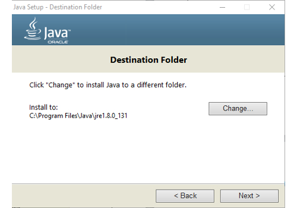

***[Change]***
`yourpcdrive:\yourdestionation\eclipsesmarthome\jre`
***[Next]***

### Launching Eclipse Smart Home Designer first time:
Execute the SmartHome-Designer.exe
`yourpcdrive:\yourdestionation\eclipsesmarthome\SmartHome-Designer.exe`

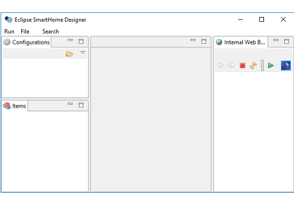

Link the Eclipse Smart Home Designer to the configuration folder on your Raspberry
**NOTE:** Make sure that you have mapped the samba drive before (see openHAB2 setup for the samba server)

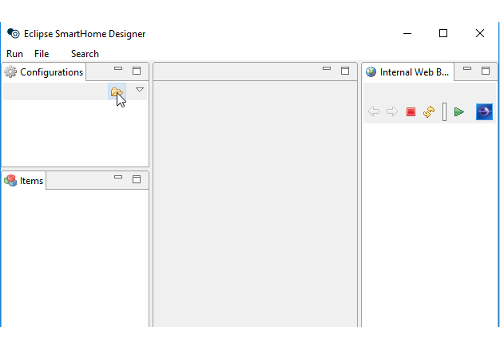

Example: If you have chosen Z:\ as drive letter the path would be:
`Z:\etc\openhab2`

Eclipse Smart Home Designer should now recognize the file structure inside the configuration folder and augment the different folders with different icons.

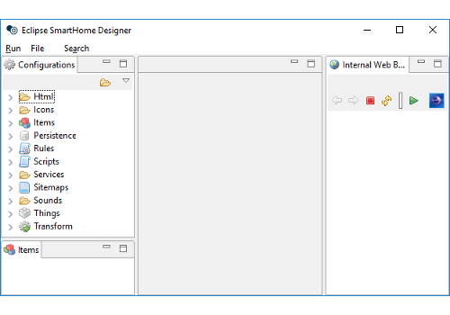

# Chapter 8: Initializing openHAB2 (finally: first startup)
To open the openHAB2 you have to access the web GUI with a browser on your PC or directly from your Raspberry, depending on your setup.
The URL will be:

**http://xxx.xxx.xxx.xxx:8080/start/index**

Just replace the *xxx.xxx.xxx.xxx* with the IP of your Raspberry.
First the GUI will ask you to select the initial setup configuration.
The walksthrough is based on the ***[Standard]*** so click on it.
This will install a standard set of GUIs in openHAB2.

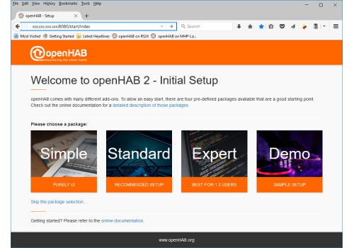

After a few minutes of installation the standard openHAB2 start GUI will come up, showing you the icons for the pre-installed GUIs:

***[BASIC UI]*** , ***[PAPER UI]*** and ***[HABPANEL]*** 

**NOTE:** Now you are ready for the configuration of your home automation project in openHAB2!

# Chapter 10: General information about configuring openHAB2
**NOTE:** Make sure to double check with the official website of openHAB2 since in the end this is where you will find the correct answers if something in this tutorial is not working:

**http://www.openhab.org/**

As a start you should read the beginners tutorial form beginning to end so you understand the basic concept of things, items, rules etc. and how they are mend to work together;

**http://docs.openhab.org/introduction.html**

## openHAB (no 2) vs. openHAB2
One of the most important things I had to learn is that there is also an openHAB (no 2)! So here are a few things if found out to be considerable if you are using openHAB2:
- Always make sure, that you are looking at the right version of openHAB when it comes down to documentation, since a lot of older online documentation is refereeing to the openHAB (no 2). When a few things might be done the same/similar way in openHAB2, other things have changed and will not work in openHAB2
- You will also encounter two different ways of storing configuration in openHAB.
-- In openHAB (no 2).configuration was stored in files only
-- In openHAB2 you can still use the files, but also can use database storage for certain typs when you do the configuration with PAPER UI. This now might lead to some confusion since you will not be able to change e.g. items in PAPER UI which were configured using a text file. Also you would not have the correct syntax highlighting in the Eclipse Smart Home Designer is expecting file configuration only an items configured in PAPER UI will show up as errors.
-- But be aware that some configuration in openHAB2 still has to be done via text file like e.g. rules. You might find already some progress in the snapshot release of openHAB2, but I decided to base this tutorial on the stable release with limited functionality in PAPER UI database
- Regularly check the website of openHAB2 for news since a lot of new features are expected to be implemented.
- Meanwhile be not afraid to go and sign up the openHAB community: **https://community.openhab.org** and ask your questions there. I got replies to my problems within days, sometimes even within hrs. There is also a designated area for beginners.

# Chapter 11: Configuring openHAB2 using PAPER UI
Since the online documentation is mostly referring to PAPER UI GUI I will try to stick to this GUI as long as possible. 
- HABmin GUI will be needed for Z-Wave network management
- HABPANEL GUI will be used to create the final user frontend for this project
**NOTE:** Since you will be regularly starting and switching the GUIs I highly recommend creating quick links in your browser for each GUI

## Installing Add-ons:
Start PAPER UI
```bash
http://xxx.xxx.xxx.xxx:8080/paperui/index.html#/inbox/search
```


### Installing Bindings:

Select ***>[Add-ons]***  ***>>[BINDINGS]*** 

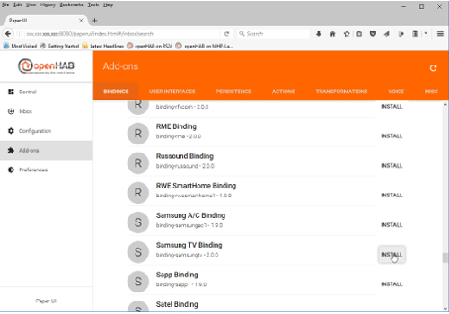

Install the Bindings:
***[Exec Binding]*** , ***[WiFi LED Binding]*** , ***[YahooWeather Binding]*** , ***[YamahaReceiver Binding]*** and ***[Z-Wave Binding]***

**Result:** The icons of the bindings should change to blue
The install option should change to uninstall. 
(Sometimes you have to reload the page if the update is not coming up for a few minutes).


**NOTE:** If you already have connected devices to the same LAN as the Raspberry, a message in the inbox will show up, telling you a new thing was found (e.g. Yamaha Receiver) How to add this thing will be explained later.

### Check the installed bindings:

Select ***>[Configuration]***  ***>>[Bindings]*** 

**Result:** You should see now all the installed bindings.

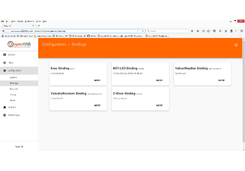

**NOTE:** You should also see the ***[WiFi LED Binding which]*** we installed before manually.

### Installing User Interfaces:

Select ***>[Add-ons]***  ***>>[USER INTERFACES]*** 

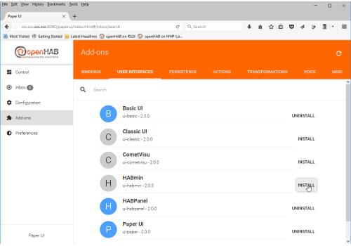

Install the User Interface ***[HABmin]*** (Required for Z-Wave network administration)

**Result:** ***[HABmin]*** GUI is installed.

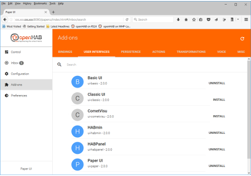

## General process of adding new things to the configuration
**NOTE:** To be able to add new things to openHAB2 depends on whether they are connected to the LAN (if you use IP), whether they are included in the Z-Wave network of the Z-Wave controller or whether your Raspberry is online if you use online sources like YahooWeather

Select ***>[Inbox]*** and click on the  ***>>[+]*** (the blue plus icon) to start adding things.

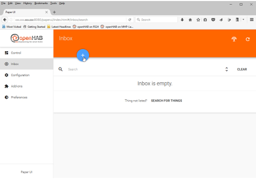

**Result:** This will now show you all the installed Bindings which can be used to add things.

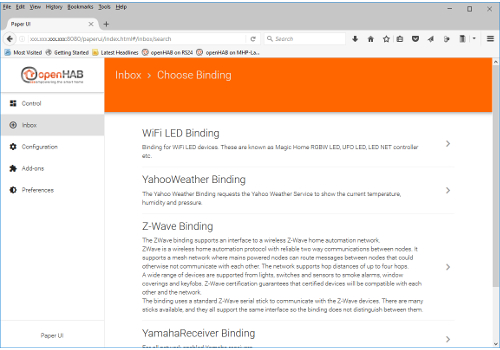

Select ***[>]*** (arrow to right) next to the required binding and go through the binding specific adding process for new things.

### Checking the added things

Select ***>[Configuration]*** ***>>[Things]***

**Result:** You should see now all the installed things.

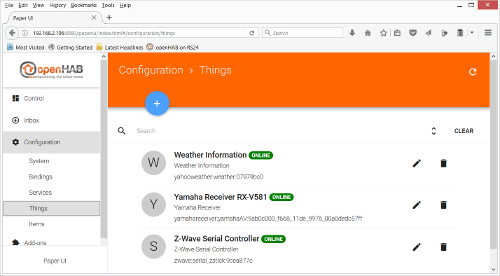

### Adding local things connected via network (IP):

**NOTE:** Make sure that the device is connected to the Raspberry network via IP.

**Result:** The connected devices should come up automatically in the inbox.

#### Adding Things using YamahaReceiver Binding:

Select ***>[Inbox]*** and click on the Yamaha Receiver ***[checkmark]*** (the blue checkmark icon).

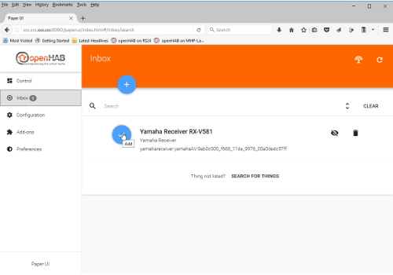

**Result:** The YamahaReceiver Binding dialogue will open, allowing you to enter/edit the name.

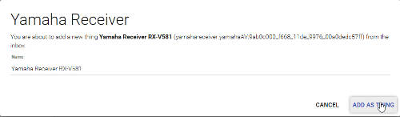

Confirm the adding by clicking on the ***[ADD AS THING]*** button

#### Adding Things using WiFi LED Binding:

Select ***>[Inbox]*** and click on the WiFi LED ***[checkmark]*** (the blue checkmark icon).

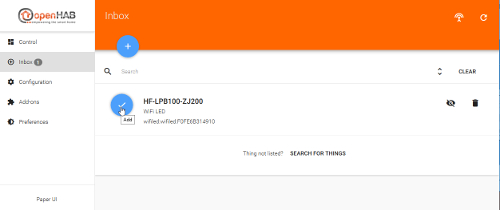

**Result:** The  WiFi LED Binding dialogue will open, allowing you to enter/edit the name.


Confirm the adding by clicking on the ***[ADD AS THING]*** button

### Adding online things connected via network (IP)

**NOTE:** Make sure the Raspberry is online.

#### Adding Things using YahooWeather Binding:

Select ***>[Inbox]*** and click on the  ***>>[+]*** (the blue plus icon) to start adding things.


**Result:** This will now show you all the installed Bindings which can be used to add things.


Select ***[>]*** (arrow to right) next to the YahooWeather Binding.

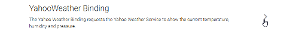

Select ***[>]*** (arrow to right) next to the Weather Information.

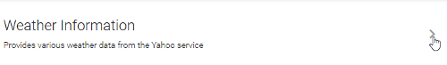

Now you have to configure the thing. In this case you have to enter the WOEID which is a 32-bit reference identifier of the weather information location. You can look up the WOEID on e.g. **http://www.woeidlookup.com/** 

**Remark:** More information on WOEID on: **https://en.wikipedia.org/wiki/WOEID**

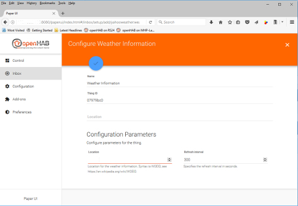


In this case we choose Berlin WOEID: `638242`

Add the thing by clicking on the ***[checkmark]*** (the blue checkmark icon)

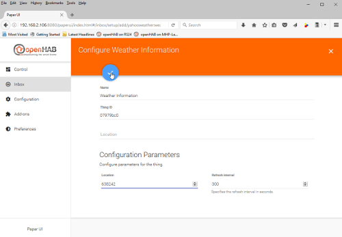

### Adding 433MHz things
#### Install additional code and configure Raspbian
Open the terminal:


##### Install git-core
```bash
sudo apt-get update
sudo apt-get install git-core
```

##### Install WiringPi
Change to home directory and download wiringPi
```bash
cd
sudo git clone git://git.drogon.net/wiringPi
```

Change to `wiringPi` directory execute build wiringPi
```bash
cd wiringPi
sudo ./build
```
##### Install 433Utils
Change to home directory and download 433Utils
```bash
cd
git clone https://github.com/ninjablocks/433Utils.git --recursive
```
Change to `433Utils/RPi_utils` directory and execute make
```bash
cd 433Utils/RPi_utils
make all
```
Change to home directory and move the 433Utils to the `/opt/433Utils` directory to make the command line works for every user
```bash
cd
sudo mv 433Utils /opt/433Utils
```

##### Allowing openHAB2 to send commands to the 433MHz transmitter
Since the 433Utils send tool is using sudo (root) rights you have to allow the openhab user to execute the sent tool with those sudo (root).

Open the sudoers config file:
```bash
sudo nano /etc/sudoers
```
Search for the chapter:
```bash
# User privilege specification
 root ALL=(ALL:ALL) ALL
```
Add the line:
```bash
openhab ALL=NOPASSWD: /opt/433Utils/RPi_utils/codesend*
openhab ALL=NOPASSWD: /opt/433Utils/RPi_utils/send*
```
Exit and save the file [Ctrl+x] > `y` > [Enter]

#### Determining the device code and testing the setup

The 433Utils tool is able to process two different kind of codes:
- `send` comand is processing an unaltered code `systemCode unitCode command` which can directly taken from some 433MHz devices. The `command` will determin to switch the device ON `1` or OFF `0`
- `codesend` comand is processing a single Ninja Blocks compatible `decimalcode` which can be sniffed using the 433MHz remote controll and the 433MHz receiver with the `sniff` command.

##### Determining the `systemCode` and `unitCode` directly form the 433MHz devices
Since I am running a German setup I only can use devices witch a German certification. I can confirm the *Brennenstuhl RCS 1000 N Comfort* or *Elro AB440S* will have the code setting with 10 bit dip switches like shown in the picture.

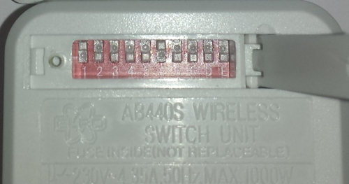

From this 10 bit dip switches you can directly read the unaltered code from the device.

Dip switch **1-5** is defining the `systemCode`, the same code you will have to set at the 5 bit dip switch of the genuine 433MHz remote controller of the set.
Dip switch **A-E** is defining the `unitCode`. **NOTE:** As specified in the genuine 433MHz remote controller manual, only one dip switch is allowed up to define the unit number. 

|bit|1|2|3|4|5|6|7|8|9|10|
|---|---|---|---|---|---|---|---|---|---|---|
|dip name on device|1|2|3|4|5|A|B|C|D|E|
|`systemCode` dips|x|x|x|x|x||||||
|`unitCode` dips||||||x|x|x|x|x|
|`unitCode` decimals||||||1|2|3|4|5|

**Example:** Refering to the picture above, the dip setting is:

|bit|1|2|3|4|5|6|7|8|9|10|
|---|---|---|---|---|---|---|---|---|---|---|
|dip name on device|UP|DOWN|DOWN|DOWN|DOWN|UP|DOWN|DOWN|DOWN|DOWN|

This represents the `systemCode` `10000` and the `unitCode` `1`

**Remark:** You might be able to determine manually the `systemCode` and `unitCode` for non 10 bit dip devices following instructions on this sites (German only):

**https://wiki.fhem.de/wiki/Intertechno_Code_Berechnung#Original_Intertechno_System**
**https://isn-systems.com/tools/it2elro/**


##### Optional: Determining `decimalcode` for unknown 433MHz devices by sniffing the remote control code
**NOTE:** before you can start sniffing, you have to make sure, the receiver is connected to the GPIO of the Raspberry.

Start the sniffing:
```bash
sudo /opt/433Utils/RPi_utils/RFSniffer
```
Press the required button on the 433MHz remote control.

You will recieve a `decimalcode` while you keep the button pressed and one ohter `decimalcode` when you release the button.

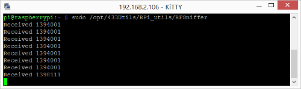

You will have to use the `decimalcode` while you keep the button pressed, in this example `1394001`

Repeat the process for all buttons you want to sniff:

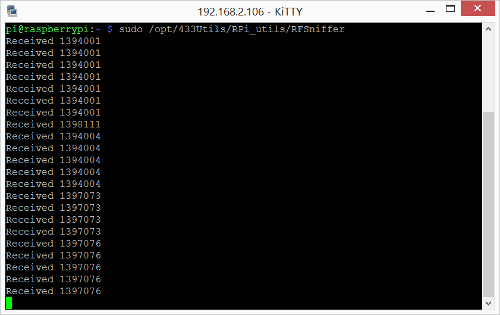

Stop the sniffing process by pressing [Ctrl+c]

##### Test sending the codes by terminal command line
###### Unaltered code `systemCode unitCode command`
Sending an unaltered code `systemCode unitCode command` 
```bash
sudo /opt/433Utils/RPi_utils/send systemCode unitCode command
```
**Example:** If you want to switch a device with the dip setting.

|bit|1|2|3|4|5|6|7|8|9|10|
|---|---|---|---|---|---|---|---|---|---|---|
|dip name on device|UP|DOWN|DOWN|DOWN|DOWN|UP|DOWN|DOWN|DOWN|DOWN|

To switch the device ON:

```bash
sudo /opt/433Utils/RPi_utils/send 10000 1 1
```
To switch the device OFF:

```bash
sudo /opt/433Utils/RPi_utils/send 10000 1 0
```

###### Single Ninja Blocks compatible `decimalcode`
Sending a single Ninja Blocks `decimalcode` 
```bash
sudo /opt/433Utils/RPi_utils/codesend decimalcode
```
**Example:** If you want to switch a device with the sniffed code `1394001`.

```bash
sudo /opt/433Utils/RPi_utils/codesend 1394001
```

#### Adding 433 MHz Things using Exec Binding:

Open the PaperUI and select ***>[Inbox]*** and click on the  ***>>[+]*** (the blue plus icon) to start adding things.


**Result:** This will now show you all the installed Bindings which can be used to add things.


Select ***[>]*** (arrow to right) next to the Exec Binding.


Select ***[>]*** (arrow to right) next to Command.

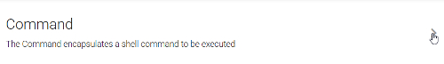

Enter the [Command] `sudo /opt/433Utils/RPi_utils/send 10000 1 1` (The same command line you used in the terminal to test the 433MHz setup).

Set the [Interval] to `0` so the command is not repeated.

Add the thing by clicking on the ***[checkmark]*** (the blue checkmark icon)

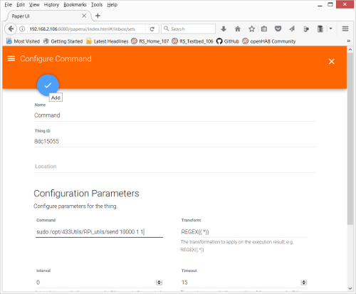

### Adding things connected via Z-Wave controller
**NOTE:** first you have to use the Z-Wave binding to add the Z-Wave controller as a thing. After this you will use HABmin to further include things into the Z-Wave network. These things should show up automatically in the inbox of PAPER UI.

#### Adding Z-Wave controller
Open the PaperUI and select ***>[Inbox]*** and click on the  ***>>[+]*** (the blue plus icon) to start adding things.


**Result:** This will now show you all the installed Bindings which can be used to add things.


Select ***[>]*** (arrow to right) next to the Exec Binding.

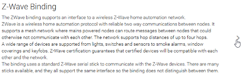

Select ***[>]*** (arrow to right) next to Z-Wave Serial Controller.

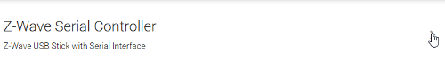

Now you have to configure the thing
In this case you have to enter the serial Port of the Z-Wave controller
The standard port where the UBS-Z-Wave controller should come up is:
`/dev/ttyACM0`


Add the thing by clicking on the ***[checkmark]*** (the blue checkmark icon)

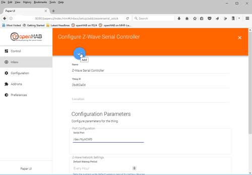

#### Adding Z-Wave things to the Z-Wave Network using HABmin UI
To include further devices to your Z-Wave network and make them available as openHAB2 things you have to use the HABmin inclusion functionality.
Please also consult the online documentation for general information about Z-Wave :

** https://github.com/openhab/org.openhab.ui.habmin/wiki/ZWave-Device-Installation**

##### Using a standard Z-Wave controller like UZB *Z-Wave PLUS USB stick by Z-Wave.Me*

Start HABmin 

Direct URL: **http://xxx.xxx.xxx.xxx:8080/habmin/index.html#/home**

Select ***>[Configuration]*** and ***>>[Things]***

HABmin will show you all the things which are available in PAPER UI as well 

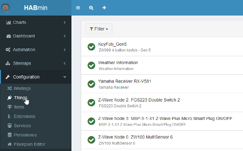

To start the inclusion mode of your Z-Wave controller in HABmin you have to select the add thing icon of HABmin ***[magnifying glass]***


Select the ***[Z-Wave Binding]***

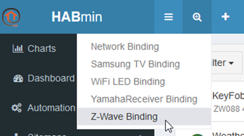

This now is triggering the inclusion mode of your Z-Wave controller 


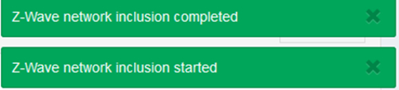

Put the Z-Wave devices in inclusion mode to be detected by the Z-Wave controller. *Please refer to the Z-Wave devices manual how to put them in inclusion mode.*

When the device is included in the Z-Wave network, the ***[plug icon]*** will show a green box with the number of the included devices.

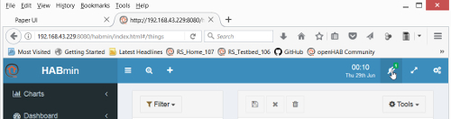

Click on the icon to show the details of the included devices. 

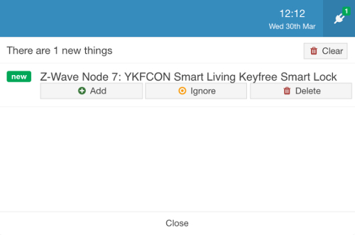

Just select the green ***[Add]*** button to include this device as a thing for openHAB2

**NOTE:** some devices may come up as “unknown device” at first. The normal reason for this is that the device was not able to finish the communication with HABmin during the inclusion process. This might be very likely for battery powered devices since the will go to sleep mode after a certain amount of time. You can still add the device because there is a way to *cure* this device by manually waking up the device (see device manual) multiple times (up to 10 times) so the communication can be completed and the device is recognized as a proper thing in HABmin.

The newly added thing should now be visible in the HABmin GUI things tab
Now you can switch to the PAPER UI and find the new things in the inbox or check the new things in the things tab.

##### Using the Aeotec by Aeon Labs Z-Stick Gen5 Z-Wave controller

The special feature of the Aeotec by Aeon Labs Z-Stick Gen5 which is the *offline inclusion*.
This means that the battery powered stick *must* not be plugged in for the Z-Wave network inclusion process. You have to unplug the stick and press the inclusion button on the stick to start the inclusion mode of this Z-Wave controller. *(Please refer to the Aeotec by Aeon Labs Z-Stick Gen5 documentation for further details.)*

To start the adding ot the included things to openHAB2 you have to again plug in the stick and make sure the stick is not offline but online.

Open the PaperUI GUI and select ***>[Configuration]*** ***>>[Things]***

The Z-Wave Serial Controller **must** be ***[ONLINE]***

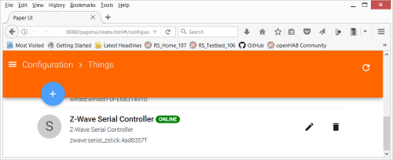

**NOTE:** If the Z-Wave Serial Controller shows up as ***[OFFLINE]***

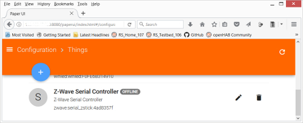

Restart the openHAB2 service with the terminal command `sudo systemctl restart openhab2.service`. After a few minutes when the service is restarted the controller should show up as ***[ONLINE]*** .

Now start the standard inclusion process in HABmin.

**NOTE:** Since the Aeotec by Aeon Labs Z-Stick Gen5 is using *offline inclusion* almost every battery powered item will come up as “unknown device” because the timespan between including the battery device to the stick and starting the inclusion process in HABmin inclusion after you plugged the stick back in will be too long and most of the devices will have gone back to sleep. You might prevent this by manually waking up the device again just seconds before you start the inclusion on HABmin. If this does not work you can always *cure* this device by manually waking up the device (see device manual) multiple times (up to 10 times) so the communication can be completed and the device is recognized as a proper thing in HABmin.

The newly added thing should now be visible in the HABmin GUI things tab
Now you can switch to the PAPER UI and find the new things in the inbox or check the new things in the things tab.

##### For details documentation on the Z-Wave Binding usage in HABmin consult:
**http://www.cd-jackson.com/index.php/openhab/habmin/10-habmin-zwave-binding-initialisation**

## Creating items form things
### The concept of Things, Channels, Items and Links:

Before we start please read first the concept of Things, Channels, Items and Links which is directly tanken from the openHAB2 User Manual page

**http://docs.openhab.org/concepts/index.html#things-channels-items-and-links**

Things are the entities that can be physically added to a system and which can potentially provide many functionalities at once. It is important to note that things do not have to be devices, but they can also represent a web service or any other manageable source of information and functionality. Things provide their functionality through a set of Channels. Channels are “passive” and can be regarded as a declaration of a Thing, what it can offer. It is up to the individual setup, which of the Channels are actively used through Items (see below).
Items represent (fine-grained) functionality that is used by applications - as user interfaces or automation logic. Items have a state and they can receive commands.
The glue between Things and Items are Links. Links are associations between exactly one Thing Channel and one Item. If a Channel is linked to an Item, it is “enabled”, which means that the functionality that the Item represents is handled through the given Channel. Channels can be linked to multiple Items and Items can be linked to multiple Channels.
To illustrate these concepts, take a two-channel actuator that controls two lights:

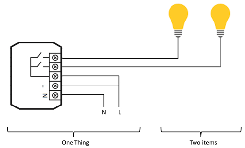

The actuator is the Thing. This might be installed in the electrical cabinet, it has a physical address and needs to be setup and configured in order to be used. The user is instead interested in the two lights, which are located at different locations in his home. These lights are the desired functionality, thus the Items and they are linked to the Channels of the actuator. A Link can be regarded like a physical wire in this example.
 
### The basic process of creating Items in PAPER UI:

**http://docs.openhab.org/tutorials/beginner/configuration.html**

This beginner tutorial is showing a general quick overview of the complete configuration process. 

#### Creating a Item walkthrough (KeyFob_Gen5 Scene Number)

Open the PaperUI GUI and select ***>[Configuration]*** ***>>[Things]*** and select the KeyFob_Gen5 thing:

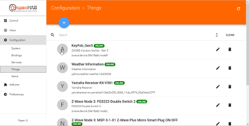

A list of all the available channels of the thing will be shown:

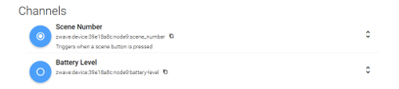

Now click on the blue icon in front of the channel number to link this channel to an item:


A link channel window will come up. Select the pull down option for the item:

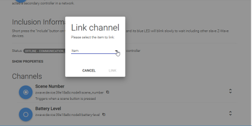

The next window coming up will allow you to select already existing items or: In our case ***[+ Create new item…]***

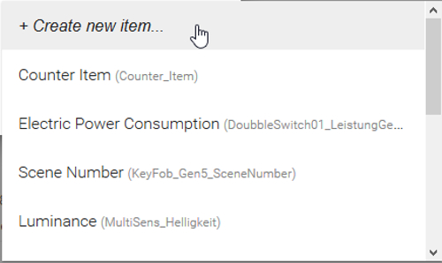

The next window will allow you to configure the item you want to link to the thing channel. You can also change the name of the item if you are planning to run with your own naming convention. Select ***[LINK]*** button to create your new item:


Now the blue icon to the left of the name will change ***[white dot in the center]*** . By clicking on this icon the channel will expand and show you the linked items to this cannel:


Select ***>[Configuration]*** ***>>[Items]*** to check the new created item:


# Chapter 12: Creating a dashboard for your home automation project
Every user interface on openHAB2 is providing its own style of dashboards to control your home automation project, display current item states and attribute values or even include online information like web pages. The complete overview of all available user interfaces can be found on:

***http://docs.openhab.org/addons/uis.html***

In the walkthrough configuration there are 4 different user interfaces available.  

Open openHAB 2 start page
```bash
http://xxx.xxx.xxx.xxx:8080
```

In this configuration you will see the 4 different UIs:

|User-Interface|Description|
|---|---|
| ***[BASIC UI]*** |The Basic UI is an HTML5 web application in Material Design, designed for operating openHAB.|
| ***[HABMIN]*** |HABmin is a modern, professional and portable user interface for openHAB, providing both user and administrative functions.|
| ***[PAPER UI]*** |The Paper UI is an AngularJS-based HTML5 web application in Material Design, designed for setup and administration purposes.|
| ***[HABPANEL]*** |HABPanel is a lightweight dashboard interface for openHAB.|

## Creating a dashboard in ***[BASIC UI]***

In the Standard setup of openHAB2 which is used in the walktrhough, there is no pre-set sitemap, so you will only get the a Welcome! message.


To create your own configuration of the dashboard you have to work with text based *sitemap* files. Since this is a beginner’s tutorial trying to get things done using as less textual coding as possible, it will not go into the details of creating a dashboard for the BASIC UI. 

You can find more information in how to customise a BASIC UI dashboard on:

**http://docs.openhab.org/configuration/sitemaps.html**

## Creating a dashboard in HABMIN dashboard

HABmin will allow to create a dashboards based on widgets. 


Since this is a beginner’s tutorial it will not go into the possibilities of how to create a dashboard with HABmin. But be aware the HABMIN is providing a powerful graphical way of creating dashboards you might want to have a look at. You can find the standard documentation on:

**http://docs.openhab.org/addons/uis/habmin/readme.html**

## Creating a dashboard in PAPER UI

**NOTE:** Paper UI currently only supports limited use cases for dashboards. It is mainly meant for setup and administration purposes, not for operation.

The ***[Control]*** tab will show you a dashboard which is showing all the things you have already added which have items created for them. 


You can also easily create different tabs of things by adding ***[Location]*** information to the thing configuration:
**NOTE:** I had issues in updating a few things, so it will be good to it while creating the things.


Now you will have  ***[Control]*** tab giving you various tabs with items grouped by their things.
The ***[OUTSIDE]*** tab:


The ***[OTHER]*** tab (all the items with no location information):


## Creating a dashboard in HABPanel
The HABPANEL UI is all about creation a dashboard for your home automation project being controlled by a touch screen. Especially in the 7” Raspberry display setup, this UI will be a nice UI for controlling your home automation project. It is still undergoing a lot of construction, so with every release you will enjoy new features. Therefore this walkthrough is detailing the creation of a dashboard in HABPanel.

Open HABPAnel start page
```bash
http://xxx.xxx.xxx.xxx:8080/HABPANEL/index.html#/
```
A complete blank panel will come up asking you to start configuration. Click on the ***[gear icon]*** :


Select ***[+ Add new dashboard]*** : 


Enter the name *Your Dashboard* and click ***[OK]*** :


You will see the created *Your Dashboard*. *Optional:* You can further configure the *Dashboard settings* by clicking on the ***[gear icon]*** at *Your Dashboard*:


Click on the *Your Dashboard* itself to start configuring the dashboard:


You will see now the *Your Dashboard* in configuration mode with the icons ***[Save]*** , ***[Run]*** and ***[Add Widget]*** . Using the ***>[Add Widget]*** ***[>> Switch]*** create switch widget:


Click on the ***[3 dots icon]*** and select Edit to start configuring the switch widget:


Enter the widget **Name** *WiFi LED Switch*, select the **openHAB Item** *HF-LPB100-ZJ200_Power* in the pull down list, select a **Backdrop Item**, check **Center backdrop horizontally** and click on ***[Save]*** to close the configuration.


Back in the *Your Dashboard* in configuration click on ***[Run]*** to test the dashboard:


You will now see the control layout of *Your Dashboard*. Clicking on the widget will now switch ON/OFF your WiFi LED:


Clicking on the ***[2 bars icon]*** will trigger the HABPanel menu where you can select between different dashboards (if created). Clicking again will close the HABPanel menu again.:


**NOTE:** Since HABPanels is designed for touchscreens you can also open and close the HABPanel menu by swiping left/right.

To *Toggle full screen* click on the ***[diagonal arrows icon]*** :


This will now show you the seamless control dashboard for your touchscreen:


To go *Edit Your Dashboard* again you have to hover over the dashboard name and then select the ***[pen icon]*** :


To reposition the widget you have to click and hold on the widget ***[crossed arrows icon]*** and drag the widget to a new location. Since the widget have to snap on a pre-set grid you will see a grey shadow indication the new grid location:


To resize the widget you have to click and hold on the ***[triangle icon]*** in lower right corner of the widget and drag the frame into the new size. Since the widget have to snap on a pre-set grid you will see a grey shadow indication the new size:


Now go on and create the missing widgets for the WiFi LED items:

|Widget|Item|
|---|---|
|Color Picker|HF-LPB100-ZJ200_Color|
|Slider|HF-LPB100-ZJ200_Color|

Position them accordingly on *Your Dashboard*:


**NOTE:** If you are configuring the dashboard on your PC it might not fit perfectly onto the 7” Raspberry display full screen due to the different aspect ratio.

Now go on and create the dashboards for all the other items you want to controll driectly.

**NOTE:** If you just want to alphanumerically display some values on your dashboard you should use the ***[Dummy]*** widget.

# Chapter 13: Creating rules

I will try to give some basic rule examples to start with but you have to be aware:

***DISCLAIMER:
I am no coding expert at all and writing rules is still the most difficult part in my home automation project (finding the right commands, the right syntax and so on), so you might be better off using to other tutorials.***

For the standard rules documentation incl. the rule syntax please refer to the online documentation:

**http://docs.openhab.org/configuration/rules-dsl.html**

You can also find some rules samples on:

**https://github.com/openhab/openhab1-addons/wiki/Samples-Rules**

And maybe some coding experts in the community will find the time to create a kind of an openHAB2 compendium to make it easier the non-experts to do rules.
**REMARK:** Yes, I know there are plenty of online documentation sites available, but the problem for me was the “plenty” part of it since I always had to go through plenty different websites to finally get the syntax right and make the rule do, what I wanted it to do.

# Chapter 13: Creating rules
Since rules can’t be configured using the PAPER UI (stable version) you now have to go to the text files for now. For this part we will now use the Eclipse Smart Home Designer since it creates at least some syntax highlighting.

**REMARK:** You might find already some functionality about configuration of rules in the PAPER UI snapshot versions so there will be some changes in the way of doing rules more easily in the future. Also HABmin is providing some kind of graphical rule engine.

## Creating the *myfirstrule.rules* file

Start Eclipse Smart Home Designer on your PC
Make sure you have mapped the Raspbian samba drive to your PC and Start Eclipse Smart Home Designer is set to the right folder in this samba drive (see Chapter 7: Installation of Eclipse Smart Home Designer -: part launching first time)
You should now the augmented icons for the different folders. If you check the Rules folder you will only find a readme.txt file:


You need to create a file with the ending .rules to store your rules there. The fastest way of doing it is using the basic file management functionality of Eclipse Smart Home Designer. Right click on the readme.txt file and select copy:


Then right click again and select Paste:


A new window will ask you to enter a new file name. Change the file name to *myfirstrule.rules* an press ***[OK]*** :


A new file will appear in the Rules folder showing the rule icon. Now double click on the file to open it and select all the text [Ctrl+a], delete the old content [Del] to have a plain rule rile. Finally save the rule file again [Ctrl+s]:


Now you can start to use *myfirstrule.rules* file to store rules.

## Example Rule: Switch on light when door is opend and it is dark

The aim is to use the devolo door sensor, which also gives you a luminance reading, to detect when it is getting dark and when the door is opend. Than 2 switches (wallmouted and plug) will switch on the ligt in the hallway.

### Devices, Things and Items

**NOTE:** If you are using different hardware you might have to adopt this changes in the list.

|Device|Thing|Channel|Item|
|---|---|---|---|
|devolo Home Control door sensor|Door_01|zwave:device:e442b469:node4:sensor_door|Door_01_DoorWindowStatus|
|devolo Home Control door sensor|Door_01|zwave:device:e442b469:node4:sensor_luminance|Door_01_SensorLuminance|
|Z-Wave Fibaro Double Switch 2|Doubleswitch_01|zwave:device:e442b469:node11:switch_binary2|Doubleswitch_01_Switch2|
|Fibaro wall plug FIBEFGWPF-102|Plug_02|zwave:device:e442b469:node2:switch_binary|Plug_02_Switch|

The rules for switching ON and OFF the ligth will be:
```bash
// this is the rules file

rule "Door_open"

when
	Item Door_01_DoorWindowStatus changed from CLOSED to OPEN
then
	if (Door_01_SensorLuminance.state < 4) {
		sendCommand (Doubleswitch_01_Switch2, ON)
		sendCommand (Plug_02_Switch, ON)
}
end


rule "Door_close"

when
	Item Door_01_DoorWindowStatus changed from OPEN to CLOSED
then
		sendCommand (Doubleswitch_01_Switch2, OFF)
		sendCommand (Plug_02_Switch, OFF)
end
```
Since the door sensor is only providing very raw luminance reading you might have to adpot the value `4`in the line `Door_01_SensorLuminance.state < 4` accordingly

## Further Rule examples based on this home automation project:
Switching ON/OFF switches based on luminance reading of the multisensory
The rule is designed to switch ON/OFF the Singleswitch_01_Switch based on the illumination measured by the MultisensG5_01_SensorLuminance
The trigger value is set to 10 LUX 
To prevent von switching on/off if the illumination is around 10 lumen and e.g. just a cloud is casting a temporarily shadow, there is a counter included which is measuring multiple times the illumination and only allows to triggering the switch if there reading is consistently (10 times) above or below the trigger value.
**NOTE:** Make sure you have create the item Counter_Item since it’s used in the rule (see: part “Creating an item the see the value of a variable of a rule online” in this chapter). 
**REMARK:** This was done as some kind of coding and configuring HABPANEL exercise. You might get the same result in just checking the reading in a less frequent period, forget about the counter and just trigger the switch when the illumination reading is above or below the trigger value.
You can also use this Counter_Item to display some tendency whether your light is about to switch ON/OFF depending on the value of the Counter_Item on your dashboard. So if you play a little with the “knob” widget in HABPANEL it might look like this:


Then you add some other readings of your multissor, the wattage reading and trigger of your switch, a clock widget and you have a complete dashboard of your real weather and let it trigger your outside ligth.


You can just add these lines at the bottom of your existing rule file or create a new file in the same folder:

```bash
// this is the rules file

var Number loop_counter = 0

rule "check_illumination"
// using the loop_counter to ensure that it is
// 10 times in a row darker/lighter before triggering switch

when
// every x seconds "0/x" the value is checked
// 0/30 means every 30 sec the value is checked 
	Time cron "0/30 * * ? * * *"
then
// reset loop_counter if required (counter outside -5 +5 range)
if (loop_counter >= -5 && loop_counter <= 5){
// <= 10 is defining the LUX value when ligth is swiched on/off
	if (MultisensG5_01_SensorLuminance.state <= 10) {
		if (loop_counter > -5) {
			loop_counter = loop_counter -1
			postUpdate(Counter_Item, loop_counter)
		}
		else {
			if (Singleswitch_01_Switch.state == OFF)
			sendCommand (Singleswitch_01_Switch, ON)
		}
	}
	else
		if (loop_counter < 5) {
			loop_counter =loop_counter +1
			postUpdate(Counter_Item, loop_counter)
		}
		else {
			if (Singleswitch_01_Switch.state == ON)
			sendCommand (Singleswitch_01_Switch, OFF)
		}
		}
else {
 		loop_counter = 0
		}
end 

//--------------------------------------------------------------------------	
```
Since this rule is using a manual Number Item please read the Tips and tricks section for how to creat a single item without a thing. 

# Chapter 14: Tips and tricks

## Basic tips for debugging rules

### Creating an item the see the value of a variable of a rule online
The standard way of debugging a rule would be to use a logfile.
For simple problems you might also be able to visualize the variables online by creation item with the same type and posting the value of the variable inside the rule. So follow the steps:
1. Set the variable *loop_counter* in your rule file: `var Number loop_counter = 0`
2. Create a new item *Counter_Item* as type *Number*
3. Post the *loop_counter* variable value to the *Counter_Item* `postUpdate(Counter_Item, loop_counter)`
4. Use a HABPanel *Dummy* widget to visualize the *Counter_Item* value. 

### Creating a dummy switch item to trigger ON/OFF rules
If you are dependend on switches changing their stat and you can not physically do this, you can also use a dummy switch item to trigger the rule.
1. Create a new item *Dummy_Swich*
2. Use a HABPanel *Switch* widget to create an interactive dummy switch

---
End of walkthrough
---

---

# Markdown syntax examples start from here:

---
General header
---


Github specific syntax
```
Fenced Code
```

```bash
Fenced code bash highlighting

```

~~Strikethrogh~~

- [ ] Tasklist
- [ ] Tasklist


# Header 1
## Header 2
### Header 3
#### Header 4
##### Header 5
###### Header 6

**Strong-Bold**

*Emphasize*

`inline code`


[link](https://community.openhab.org/)

> Blockquote
>> Blockquote
>>> Blockquote

1. Ordered List
2. Ordered List

- Unordered List
- Unordered List

Page Break before
* * *
Page Break after

Section Break before
- - -
Section Break before

Sentence Break before
_ _ _
Sentence Break before

<!--This is a comment-->


| column     | column     | column     |
|:---|:---:|---:|
|            |            |
|left       |centered   |right|
|  -  |     -    | - |


|text|picture|
|---|---|
|blabla||


